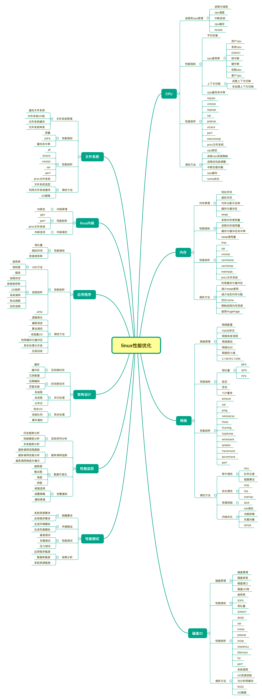

#### linux-notes

Linux性能优化记录和总结,发现只有不断的学习和不断的完善知识体系才能提升自己的认知,这个过程是相互促进和提高的,也记录下自己最近在看的书的一些感悟,提升到最后的时候都是在不断的完善自己的知识体系.

 

最近在看的书:

1. 语言
2. 容器
3. 网络
4. linux底层
5. 调度
6. 数据库存储
7. 数据结构和算法
8. 消息队列
9. 思维(回归最简单的思维)
10. 哲学

总结的目录:

* [平均负载](https://github.com/KeKe-Li/linux-notes/blob/master/src/chapter01/01.0.md)
* [linux中的上下文切换](https://github.com/KeKe-Li/linux-notes/blob/master/src/chapter02/01.0.md)
* [linux中的中断](https://github.com/KeKe-Li/linux-notes/blob/master/src/chapter03/01.0.md)
* [计算机的硬件组成](https://github.com/KeKe-Li/linux-notes/blob/master/src/chapter04/01.0.md)
* [linux的内存分布](https://github.com/KeKe-Li/linux-notes/blob/master/src/chapter05/01.0.md)
* [cpu性能优化](https://github.com/KeKe-Li/linux-notes/blob/master/src/chapter06/01.0.md)
* [文件系统与磁盘](https://github.com/KeKe-Li/linux-notes/blob/master/src/chapter07/01.0.md)
* [浮点数在计算机中是如何存储](https://github.com/KeKe-Li/linux-notes/blob/master/src/chapter08/01.0.md)
* [linux中内存升高了如何解决](https://github.com/KeKe-Li/linux-notes/blob/master/src/chapter09/01.0.md)
* [系统的cpu使用率很高，但是为啥找不到高cpu的应用？](https://github.com/KeKe-Li/linux-notes/blob/master/src/chapter10/01.0.md)
* [磁盘IO性能优化方式](https://github.com/KeKe-Li/linux-notes/blob/master/src/chapter11/01.0.md)
* [linux网络模型](https://github.com/KeKe-Li/linux-notes/blob/master/src/chapter12/01.0.md)
* [内存对齐](https://github.com/KeKe-Li/linux-notes/blob/master/src/chapter13/01.0.md)
* [linux进程和线程](https://github.com/KeKe-Li/linux-notes/blob/master/src/chapter14/01.0.md)
* [linux学习的一些总结](https://github.com/KeKe-Li/linux-notes/blob/master/src/chapter15/01.0.md)
