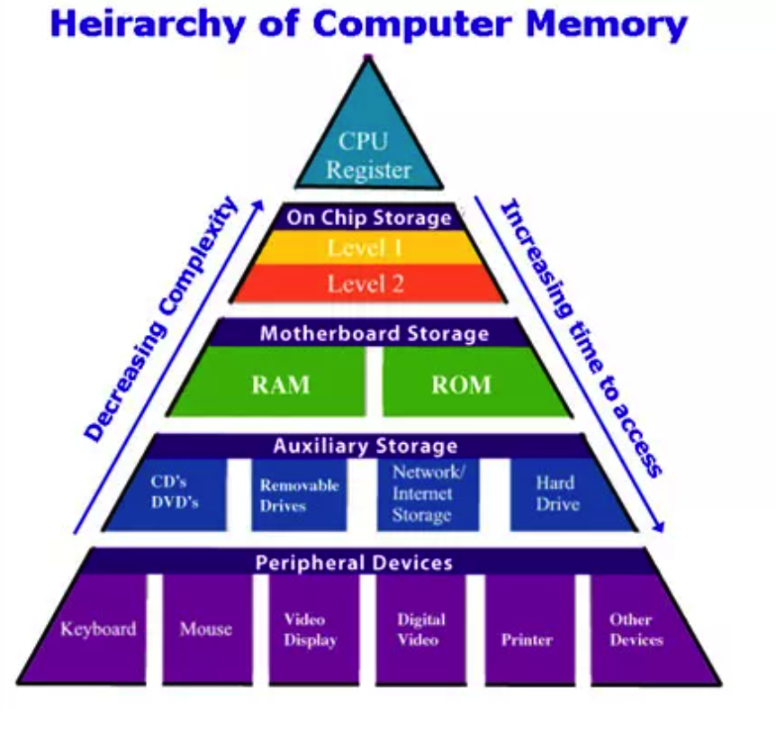
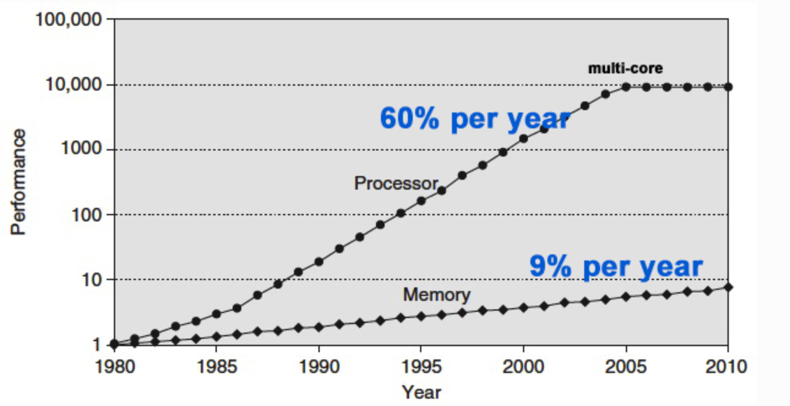
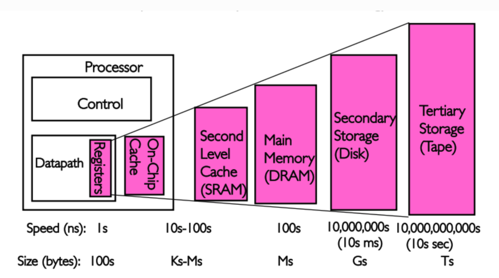

#### 计算机的硬件组成

上面这幅图代表了计算机的存储体系，从上至下依次是：

* CPU寄存器

* Cache

* 内存

* 硬盘等辅助存储设备

* 鼠标,键盘,显示屏等外接设备

从上至下，访问速度越来越慢，访问时间越来越长。

其实我们可以思考下为何会这样呢?

因为随着技术的不断的发展,CPU的速度提升的越来越快,但硬盘等持久存储很慢，如果CPU直接访问磁盘，磁盘可以拉低CPU的速度，机器整体性能就会低下，为了弥补这2个硬件之间的速率差异，所以在CPU和磁盘之间增加了比磁盘快很多的内存。

从上图可以看到，CPU的速率提高的很快，然而内存速率增长的很慢，虽然CPU的速率现在增加的很慢了，但是内存的速率也没增加多少，速率差距很大.

早期的 CPU 并没有 cache，以起于 1978 年的`intel x86` 芯片为例，它从 1992 年开始才开始引入 cache:

* 1992: 386 platform 引入 L1 cache,L1速率最快,与CPU速率最接近,是RAM速率的100倍.
* 1995: Pentium Pro 引入 L2 cache,L2速率就降到了RAM的25倍.
* 2008: Core i3 引入 L3 cache, L3的速率更靠近RAM的速率.

CPU 和 RAM 主频的增长速率的巨大差距是 cache 引入的直接原因，上图展示了从1980年到2010年二者的发展状况，CPU性能的年增长速度约为 60%，而RAM仅有约9%巨大的差异导致数十年后CPU的速度约比RAM快数百倍。

但是到这里可能会有人问,为什么不提高 RAM 的速度，因为成本太高！

成本因素也是 cache 分为多级的原因。越快的越贵，所以容量小；越慢越廉，容量可很大，它是成本和性能之间的折中方案。CS162 如下两句原话很好的概括了 cache 的作用。
            
* Present as much memory as in the cheapest technology
* Provide access at speed offered by the fastest technology

因此,由于CPU和内存速率不断拉大差距，为了弥补这2个硬件之间的速率差异，所以在CPU跟内存之间增加了比内存更快的Cache，Cache是内存数据的缓存，可以降低CPU访问内存的时间。

#### CPU

中央处理器（CPU，Central Processing Unit）是一块超大规模的集成电路，是一台计算机的运算核心（Core）和控制核心（ Control Unit）。

它的功能主要是解释计算机指令以及处理计算机软件中的数据。中央处理器主要包括运算器（算术逻辑运算单元，ALU，Arithmetic Logic Unit）和高速缓冲存储器（Cache）及实现它们之间联系的数据（Data）、控制及状态的总线（Bus）。

它与内部存储器（Memory）和输入/输出（I/O）设备合称为电子计算机三大核心部件。

#### 寄存器

寄存器是中央处理器内的组成部份。它跟CPU有关。寄存器是有限存贮容量的高速存贮部件，它们可用来暂存指令、数据和位址。在中央处理器的控制部件中，包含的寄存器有指令寄存器(IR)和程序计数器(PC)。在中央处理器的算术及逻辑部件中，包含的寄存器有累加器(ACC)。

#### 存储器

存储器范围最大，它几乎涵盖了所有关于存储的范畴。你所说的寄存器，内存，都是存储器里面的一种。凡是有存储能力的硬件，都可以称之为存储器，这是自然，硬盘更加明显了，它归入外存储器行列，由此可见。

#### 内存

内存既专业名上的内存储器，它不是个什么神秘的东西，它也只是存储器中的沧海一粟，它包涵的范围也很大，一般分为只读存储器（ROM）和随机存储器（RAM），以及最强悍的高速缓冲存储器（CACHE），只读存储器应用广泛，它通常是一块在硬件上集成的可读芯片，作用是识别与控制硬件，它的特点是只可读取，不能写入。

随机存储器的特点是可读可写，断电后一切数据都消失，我们所说的内存条就是指它了。

#### 缓存

Cache缓存就是数据交换的缓冲区（称作Cache），当某一硬件要读取数据时，会首先从缓存中查找需要的数据，如果找到了则直接执行，找不到的话则从内存中找。由于缓存的运行速度比内存快得多，故缓存的作用就是帮助硬件更快地运行。因为缓存往往使用的是RAM（断电即掉的非永久储存），所以在用完后还是会把文件送到硬盘等存储器里永久存储。电脑里最大的缓存就是内存条了，最快的是CPU上镶的L1和L2缓存，显卡的显存是给显卡运算芯片用的缓存，硬盘上也有16M或者32M的缓存。

Cache是在CPU中速度非常块，而容量却很小的一种存储器，它是计算机存储器中最强悍的存储器。由于技术限制，容量很难提升。

#### ROM和RAM

* RAM: 随机存取存储器.

ROM和RAM指的都是半导体存储器，ROM是`Read Only Memory`的缩写，RAM是`Random Access Memory`的缩写。ROM在系统停止供电的时候仍然可以保持数据，而RAM通常都是在掉电之后就丢失数据，典型的RAM就是计算机的内存。

RAM有两大类，一种称为静态RAM（Static RAM/SRAM），当数据被存入其中后不会消失。SRAM速度非常快，是目前读写最快的存储设备了。当这个SRAM 单元被赋予0 或者1 的状态之后，它会保持这个状态直到下次被赋予新的状态或者断电之后才会更改或者消失。但是存储1bit 的信息需要4-6 只晶体管。因此它也非常昂贵，所以只在要求很苛刻的地方使用，譬如CPU的一级缓冲，二级缓冲。另一种称为动态RAM（Dynamic RAM/DRAM），DRAM 必须在一定的时间内不停的刷新才能保持其中存储的数据。DRAM 只要1 只晶体管就可以实现。DRAM保留数据的时间很短，速度也比SRAM慢，不过它还是比任何的ROM都要快，但从价格上来说DRAM相比SRAM要便宜很 多，计算机内存就是DRAM的。

DRAM分为很多种，常见的主要有`FPRAM/FastPage`、`EDORAM`、`SDRAM`、`DDR RAM`、`RDRAM`、`SGRAM`以及`WRAM`等，这里介绍其中的一种`DDR RAM`。`DDR RAM（Date-Rate RAM）`也称作`DDR SDRAM`，这种改进型的`RAM`和`SDRAM`是基本一样的，不同之处在于它可以在一个时钟读写两次数据，这样就使得数据传输速度加倍了。这是目前电脑中用 得最多的内存，而且它有着成本优势，事实上击败了Intel的另外一种内存标准－`Rambus DRAM`。在很多高端的显卡上，也配备了高速`DDR RAM`来提高带宽，这可以大幅度提高3D加速卡的像素渲染能力。

* ROM: 只读存储器或者固化存储器

ROM也有很多种，PROM是可编程的ROM，PROM和EPROM（可擦除可编程ROM）两者区别是，PROM是一次性的，也就是软件灌入后，就无法修 改了，这种是早期的产品，现在已经不可能使用了，而EPROM是通过紫外光的照射擦出原先的程序，是一种通用的存储器。另外一种EEPROM是通过电子擦出，价格很高，写入时间很长，写入很慢。
