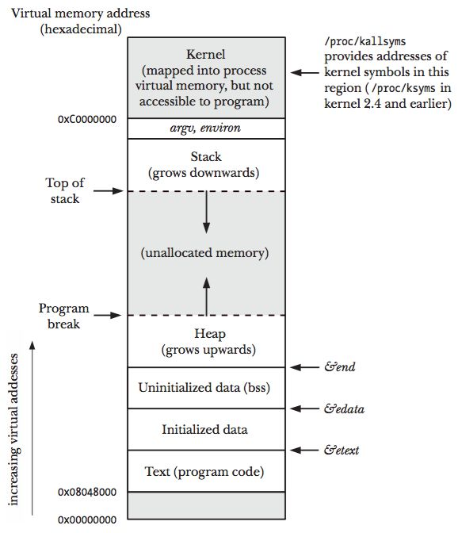
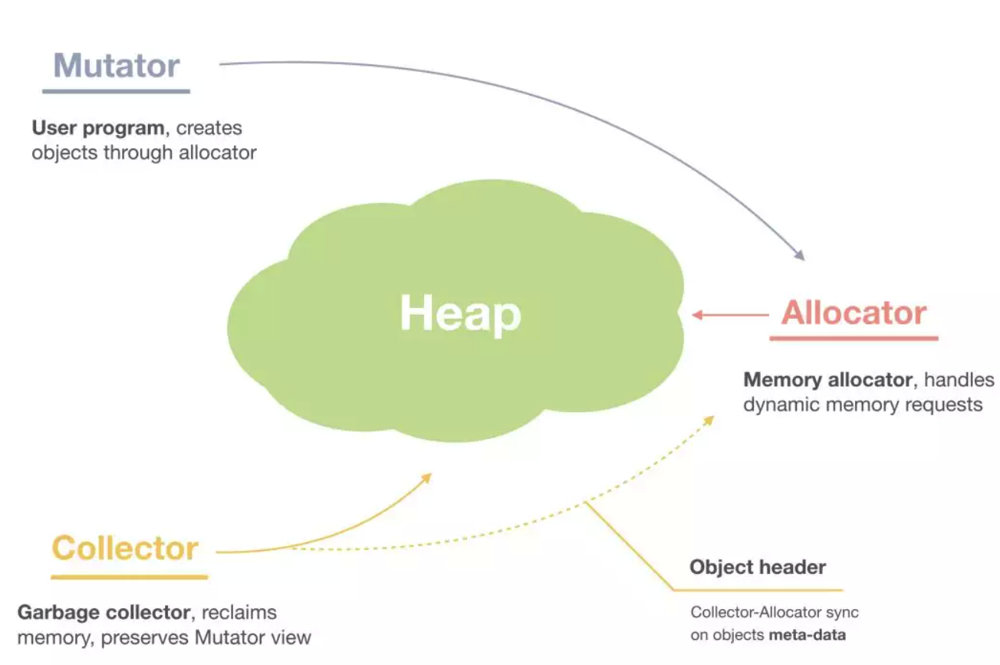
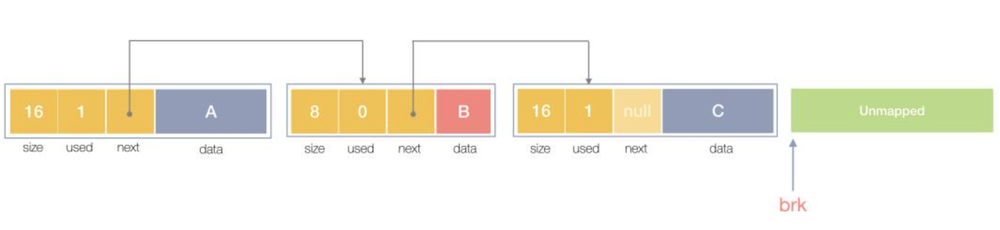
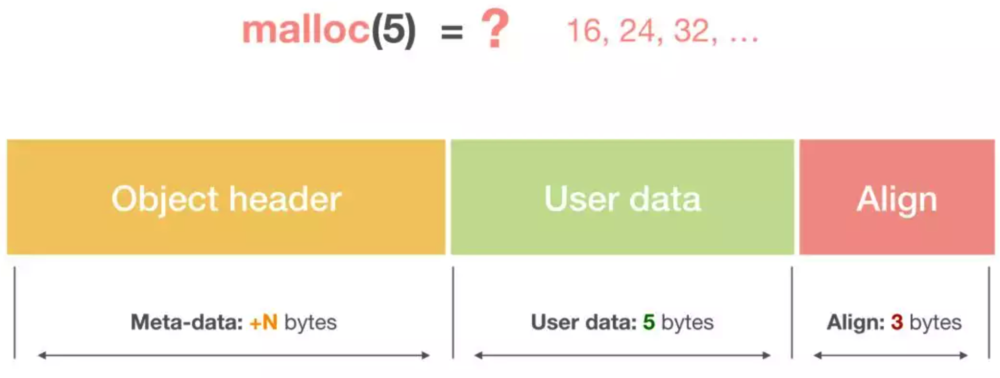
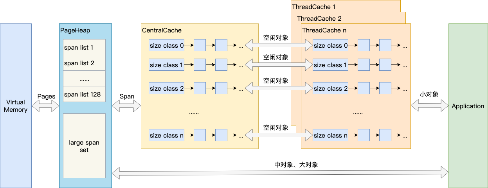
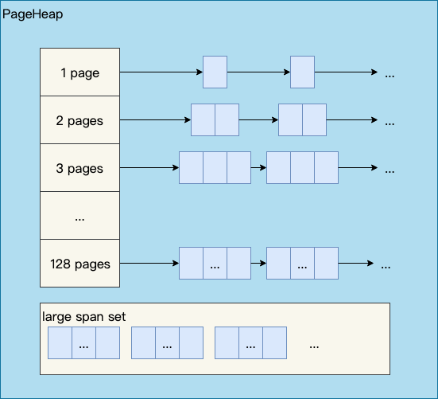

#### linux中的内存分布

在Linux里，其实有不少的内存管理库，比如glibc的`ptmalloc`，FreeBSD的`jemalloc`，Google的`tcmalloc`等等，为何会出现这么多的内存管理库？

其实本质都是在多线程编程下，追求更高内存管理效率,更快的分配内存。

#### 虚拟内存

引入虚拟内存目的是为了让内存的并发访问问题的粒度从多进程级别，降低到多线程级别。

虚拟内存是当代操作系统必备的一项重要功能了，它向进程屏蔽了底层了RAM和磁盘，并向进程提供了远超物理内存大小的内存空间。

访问内存，实际访问的是虚拟内存，虚拟内存通过页表查看，当前要访问的虚拟内存地址，是否已经加载到了物理内存，如果已经在物理内存，则取物理内存数据，如果没有对应的物理内存，则从磁盘加载数据到物理内存，并把物理内存地址和虚拟内存地址更新到页表。

早前在没有虚拟内存的时代，物理内存对所有进程是共享的，多进程同时访问同一个物理内存存在并发访问问题。引入虚拟内存后，每个进程都要各自的虚拟内存，内存的并发访问问题的粒度从多进程级别，可以降低到多线程级别。


#### 堆内存管理

<p align="center">

</p>

上图展示了一个进程的虚拟内存划分，代码中使用的内存地址都是虚拟内存地址，而不是实际的物理内存地址。栈和堆只是虚拟内存上2块不同功能的内存区域：

* 栈在高地址，从高地址向低地址增长。

* 堆在低地址，从低地址向高地址增长。

栈和堆相比有这么几个好处：

* 栈的内存管理简单，分配比堆上快。

* 栈的内存不需要回收，而堆需要，无论是主动free，还是被动的垃圾回收，这都需要花费额外的CPU。

* 栈上的内存有更好的局部性，堆上内存访问就不那么友好了，CPU访问的2块数据可能在不同的页上，CPU访问数据的时间可能就上去了。

#### 栈内存管理

<p align="center">

</p>

通常内存管理，主要是指堆内存的管理，因为栈的内存管理不需要程序去操心。上图所示主要是3部分：分配内存块，回收内存块和组织内存块。

在内存管理中，堆内存最初会是一个完整的大块，即未分配内存，当来申请的时候，就会从未分配内存，分割出一个小内存块(block)，然后用链表把所有内存块连接起来。需要一些信息描述每个内存块的基本信息，比如大小(size)、是否使用中(used)和下一个内存块的地址(next)，内存块实际数据存储在data中。

<p align="center">

</p>

一个内存块包含了3类信息，如下图所示，元数据、用户数据和对齐字段，内存对齐是为了提高访问效率。下图申请5Byte内存的时候，就需要进行内存对齐。

<p align="center">

</p>

释放内存实质是把使用的内存块从链表中取出来，然后标记为未使用，当分配内存块的时候，可以从未使用内存块中有先查找大小相近的内存块，如果找不到，再从未分配的内存中分配内存。

上面这个简单的设计中还没考虑内存碎片的问题，因为随着内存不断的申请和释放，内存上会存在大量的碎片，降低内存的使用率。为了解决内存碎片，可以将2个连续的未使用的内存块合并，减少碎片。

#### TCMalloc

TCMalloc是google开发的一个专门为高并发场景优化的内存分配器，全称为”Thread Cache Malloc”。按照官网的介绍，TCMalloc相比于glibc2.3的malloc(底层实现为ptmalloc2)主要有以下优点：

* 快速

通常在一台linux上，执行一次malloc及free大约需要300纳秒;而tcmalloc的版本同样的操作大约只需要50纳秒。

* 空间占用小

相比ptmalloc2，tcmalloc对小对象占用空间进行了优化。例如：分配N个8字节对象只需要占用8N*1.01字节的空间。即，只需要多使用1%的空间。而ptmalloc2中每个对象都需要使用一个4字节的头信息，最后占用的字节可能达到8N*8。

* 不容易出现内存暴涨

TCMalloc的做法是什么呢？为每个线程预分配一块缓存，线程申请小内存时，可以从缓存分配内存，这样有2个好处：

为线程预分配缓存需要进行1次系统调用，后续线程申请小内存时，从缓存分配，都是在用户态执行，没有系统调用，缩短了内存总体的分配和释放时间，这是快速分配内存的第二个层次。

多个线程同时申请小内存时，从各自的缓存分配，访问的是不同的地址空间，无需加锁，把内存并发访问的粒度进一步降低了，这是快速分配内存的第三个层次。


TCMalloc基本原理:

<p align="center">

</p>

Page：操作系统对内存管理以页为单位，TCMalloc也是这样，只不过TCMalloc里的Page大小与操作系统里的大小并不一定相等，而是倍数关系。《TCMalloc解密》里称x64下Page大小是8KB。

Span：一组连续的Page被称为Span，比如可以有2个页大小的Span，也可以有16页大小的Span，Span比Page高一个层级，是为了方便管理一定大小的内存区域，Span是TCMalloc中内存管理的基本单位。

ThreadCache：每个线程各自的Cache，一个Cache包含多个空闲内存块链表，每个链表连接的都是内存块，同一个链表上内存块的大小是相同的，也可以说按内存块大小，给内存块分了个类，这样可以根据申请的内存大小，快速从合适的链表选择空闲内存块。由于每个线程有自己的ThreadCache，所以ThreadCache访问是无锁的。

CentralCache：是所有线程共享的缓存，也是保存的空闲内存块链表，链表的数量与ThreadCache中链表数量相同，当ThreadCache内存块不足时，可以从CentralCache取，当ThreadCache内存块多时，可以放回CentralCache。由于CentralCache是共享的，所以它的访问是要加锁的。

PageHeap：PageHeap是堆内存的抽象，PageHeap存的也是若干链表，链表保存的是Span，当CentralCache没有内存的时，会从PageHeap取，把1个Span拆成若干内存块，添加到对应大小的链表中，当CentralCache内存多的时候，会放回PageHeap。如下图，分别是1页Page的Span链表，2页Page的Span链表等，最后是large span set，这个是用来保存中大对象的。毫无疑问，PageHeap也是要加锁的。

<p align="center">

</p>

TCMalloc定义的小对象,中对象,大对象：

* 小对象大小：0~256KB

* 中对象大小：257~1MB

* 大对象大小：>1MB

小对象的分配流程：ThreadCache -> CentralCache -> HeapPage，大部分时候，ThreadCache缓存都是足够的，不需要去访问CentralCache和HeapPage，无锁分配加无系统调用，分配效率是非常高的。

中对象分配流程：直接在PageHeap中选择适当的大小即可，128 Page的Span所保存的最大内存就是1MB。

大对象分配流程：从large span set选择合适数量的页面组成span，用来存储数据。

通常在发现内存紧张时候，系统就会通过一系列机制来回收内存：

* 回收缓存，比如使用 LRU（Least Recently Used）算法，回收最近使用最少的内存页面；
* 回收不常访问的内存，把不常用的内存通过交换分区直接写到磁盘中；
* 杀死进程，内存紧张时系统还会通过 OOM（Out of Memory），直接杀掉占用大量内存的进程。


其中OOM（Out of Memory），是内核的一种保护机制。它监控进程的内存使用情况，并且使用 oom_score 为每个进程的内存使用情况进行评分：

* 一个进程消耗的内存越大，oom_score 就越大；
* 一个进程运行占用的 CPU 越多，oom_score 就越小。

oom_adj 的范围是`[-17, 15]`，数值越大，表示进程越容易被 OOM 杀死；数值越小，表示进程越不容易被 OOM 杀死，其中 -17 表示禁止 OOM。 比如用下面的命令，你就可以把 sshd 进程的 oom_adj 调小为 -16，这样， sshd 进程就不容易被 OOM 杀死。

```bash
> echo -16 > /proc/$(pidof sshd)/oom_adj
```

#### 查看系统的内存

查看系统的内存我们是通过free命令查看.free 显示的是整个系统的内存使用情况。

```bash
> free
              total        used        free      shared  buff/cache   available
Mem:       16266952      886352     8220312        1992     7160288    14795128
Swap:             0           0           0
```
1. total 是总内存大小；
2. used 是已使用内存的大小，包含了共享内存；
3. free 是未使用内存的大小；
4. shared 是共享内存的大小；
5. buff/cache 是缓存和缓冲区的大小；
6. available 是新进程可用内存的大小。available 不仅包含未使用内存，还包括了可回收的缓存，所以一般会比未使用内存更大。不过，并不是所有缓存都可以回收，因为有些缓存可能正在使用中。


当我们打开应用服务很多的时候,我们希望可以手动去查看哪个服务占用的内存和服务资源更多,这个时候我们就需要使用系统命令去查看了,通常我们都是用top或者htop去查看.


#### 参考资料

* [Writing a Memory Allocator](http://dmitrysoshnikov.com/compilers/writing-a-memory-allocator/)
