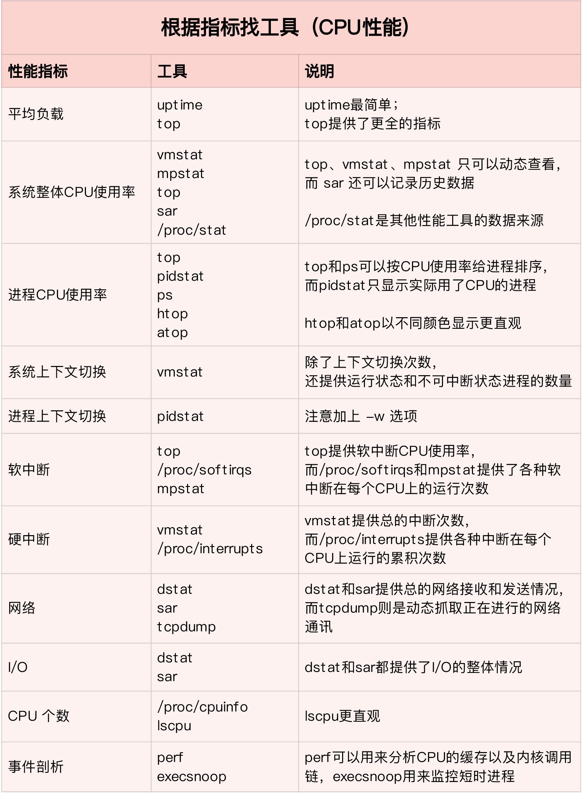
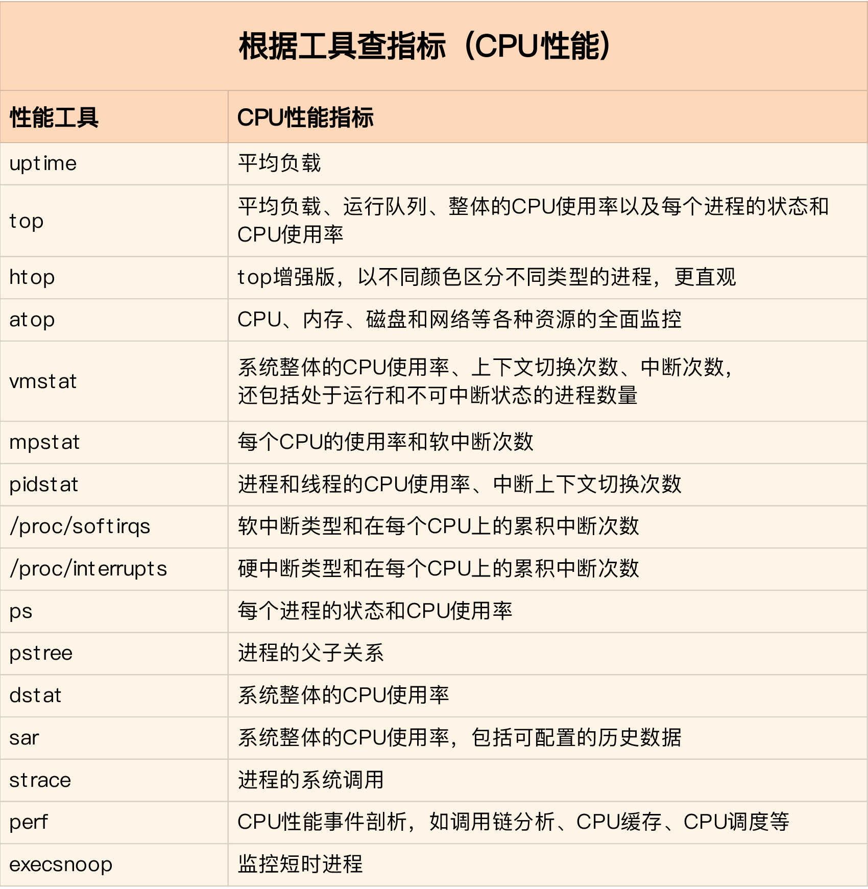

#### cpu性能优化

在我们应用服务中,经常会出现cpu飚升的问题,通常遇到这样的问题,在go中我们会用pprof分析,然后查找到对应的服务,定位服务调用路,然后看cpu占用,进而优化程序.

但是在linux中我们是否也是也如此呢?答案是肯定的我们需要先定位,然后根据cpu的性能指标去确定,然后优化.

在linux中我们使用的命令如top,vmstat,pidstat等都可以查下cpu的性能指标.

首先我们在确定优化的时候先要做的事情是:

1. 确定性能的量化指标；
2. 测试优化前的性能指标；
3. 测试优化后的性能指标。

从操作上来说，多维度指标的选择、多性能问题的选择、多优化方法的选择，这三者都是我们考虑的重点。

下面我们看下要如何才能降低CPU使用率，提高CPU的并行处理能力。

#### 应用程序优化

首先，从应用程序的角度来说，降低cpu使用率的最好方法当然是，排除所有不必要的工作，只保留最核心的逻辑。比如减少循环的层次，减少递归，减少动态内存分配等等。

但是我们的应用程序的性能优化也包括很多种方法。

* 编译器优化：很多编译器都会提供优化选项，适当优化开启它们，在编译阶段你就可以获得编译器的帮助，来提升性能。比如，gcc就提供了优化选项-o2，开启后会自动对应程序的代码进行优化。
* 算法优化：使用复杂度更低的算法，可以显著加快处理速度。比如，在数据比较大的情况下，可以用O(nlogn)的排序算法（如快排，归并排序等），代替O(n^2)的排序算法（如冒泡，插入排序等）
* 异步处理：使用异步处理，可以避免程序因为等待某个资源而一直阻塞，从而提升程序的并发处理能力。比如，把轮询替换为事件通知，就可以避免轮询耗费cpu的问题
* 多线程代替多进程：前面讲过，相对于进程的上下文切换，线程的上下文切换并不切换进程地址空间，因此可以降低上下文切换的成本。
* 善用缓存：经常访问的数据或者计算过程中的步骤，可以放到内存中缓存起来，这样下次用时就能直接从内存中获取，加快程序的处理速度。

#### 系统优化
     
从系统的角度来说，优化CPU的运行，一方面要充分利用CPU缓存的本地性，加速缓存访问；

另一方面，就是要控制进出的CPU使用情况，减少进程间的相互影响。

系统优化的的方法主要是:

* CPU绑定:把进程绑定到一个或者多个cpu上，可以提高CPU缓存的命中率，减少跨cpu调度带来的上下文切换问题
* CPU独占:跟cpu绑定类似，进一步将CPU分组，并通过cpu亲和性机制为其分配进程。这样，这些cpu就由指定的进程独占，换句话说，不允许其他进程再来使用这些cpu
* 优先级调整：使用nice调整进程的优先级，正值调低优先级，负值调高优先级。在这里，适当降低非核心应用的优先级，增高核心应用的优先级，可以确保核心应用得到优先处理。
* 为进程设置资源限制：使用linux cgroups 来设置进程的CPU使用上限，可以防止由于某个应用自身的问题，而耗尽系统资源。
* NUMA(Non-Uniform Memory Access)优化：支持NUMA的处理器会被划分为多个node，每个node都有自己的本地内存空间。NUMA优化，其实就是让CPU尽可能只访问本地内存。

中断负载均衡：无论是软中断还是硬中断，它们的中断处理程序都可能会耗费大量的cpu。开启`irqbalance`服务或者配置`smp_affinity`，就可以把中断处理过程自动负载均衡到多个CPU上。

#### 检查 Linux 服务器性能命令

通过执行以下命令，可以在 1 分钟内对系统资源使用情况有个大致的了解。

* uptime
* vmstat 1
* pidstat 1
* iostat -xz 1
* free -m
* sar -n DEV 1
* sar -n TCP,ETCP 1
* top

这里的一些命令需要安装 sysstat 包，有一些由 procps 包提供。

这些命令的输出，有助于快速定位性能瓶颈，检查出所有资源（CPU、内存、磁盘 IO 等）的利用率（utilization）、饱和度（saturation）和错误（error）度量，也就是所谓的 USE 方法。

1. `uptime` 可以快速查看机器的负载情况

```bash
> uptime
13:07:51 up 10 days,  1:23,  1 user,  load average: 0.03, 0.06, 0.05
```

在 Linux 系统中，这些数据表示等待 CPU 资源的进程和阻塞在不可中断 IO 进程（进程状态为 D）的数量。这些数据可以让我们对系统资源使用有一个宏观的了解。
   
该命令的输出分别表示 1 分钟、5 分钟、15 分钟的平均负载情况。通过这三个数据，可以了解服务器负载是在趋于紧张还是区域缓解。如果 1 分钟平均负载很高，而 15 分钟平均负载很低，说明服务器正在命令高负载情况，需要进一步排查 CPU 资源都消耗在了哪里。反之，如果 15 分钟平均负载很高，1 分钟平均负载较低，则有可能是 CPU 资源紧张时刻已经过去。

通过上面的输出，可以看到最近 1 分钟的平均负载非常高，且远高于最近 15 分钟负载，因此我们需要继续排查当前系统中有什么进程消耗了大量的资源。

2. `vmstat` 可以输出系统的核心指标

```bash
> vmstat 1
procs -----------memory---------- ---swap-- -----io---- -system-- ------cpu-----
 r  b   swpd   free   buff  cache   si   so    bi    bo   in   cs us sy id wa st
 1  0      0 1471216  23776 13842736    0    0    31    22    3    1  1  0 99  0  0
 0  0      0 1471224  23776 13842768    0    0     0     0 2106 3426  0  0 100  0  0
 0  0      0 1471212  23776 13842768    0    0     0     0 3748 5788  0  0 100  0  0
 0  0      0 1470976  23776 13842768    0    0     0   112 1812 3160  0  0 100  0  0
 0  0      0 1470976  23776 13842768    0    0     0     0 1589 2646  0  0 100  0  0
 0  0      0 1470720  23776 13842768    0    0     0     0 2030 3477  0  0 100  0  0
```

`vmstat` 后面跟的参数 1，表示每秒输出一次统计信息，表头提示了每一列的含义.

```markdown
* r：等待在 CPU 资源的进程数。这个数据比平均负载更加能够体现 CPU 负载情况，数据中不包含等待 IO 的进程。如果这个数值大于机器 CPU 核数，那么机器的 CPU 资源已经饱和。

* free：系统可用内存数（以千字节为单位），如果剩余内存不足，也会导致系统性能问题。下文介绍到的 free 命令，可以更详细的了解系统内存的使用情况。

* si, so：交换区写入和读取的数量。如果这个数据不为 0，说明系统已经在使用交换区（swap），机器物理内存已经不足。

* us, sy, id, wa, st：这些都代表了 CPU 时间的消耗，它们分别表示用户时间（user）、系统（内核）时间（sys）、空闲时间（idle）、IO 等待时间（wait）和被偷走的时间（stolen，一般被其他虚拟机消耗）。
```

这些 CPU 时间，可以让我们很快了解 CPU 是否出于繁忙状态。一般情况下，如果用户时间和系统时间相加非常大，CPU 出于忙于执行指令。如果 IO 等待时间很长，那么系统的瓶颈可能在磁盘 IO。

通过显示我们可以看到, 大量 CPU 时间消耗在用户态，也就是用户应用程序消耗了 CPU 时间。然而呢,这不一定是性能问题，需要结合 r 队列，一起去分析。

3. `pidstat` 输出进程的 CPU 占用率

```bash 
> pidstat 1
Linux 3.10.0-957.21.3.el7.x86_64 (zqg-es-103) 	06/26/2020 	_x86_64_	(16 CPU)

01:14:27 PM   UID       PID    %usr %system  %guest    %CPU   CPU  Command
01:14:28 PM     0     10280    0.00    1.98    0.00    1.98    15  pidstat
01:14:28 PM     0     10421    0.00    0.99    0.00    0.99     3  kubelet

01:14:28 PM   UID       PID    %usr %system  %guest    %CPU   CPU  Command
01:14:29 PM     0      1864    0.00    1.00    0.00    1.00     0  AliYunDun
01:14:29 PM     0     10280    1.00    1.00    0.00    2.00    15  pidstat
01:14:29 PM     0     10421    1.00    0.00    0.00    1.00     3  kubelet
```

pidstat 命令输出进程的 CPU 占用率，该命令会持续输出，并且不会覆盖之前的数据，可以方便观察系统动态。

4. `iostat` 命令主要用于查看机器磁盘IO情况

```bash
> iostat -xz 1
Linux 3.10.0-957.21.3.el7.x86_64 (zqg-es-103) 	06/26/2020 	_x86_64_	(16 CPU)

avg-cpu:  %user   %nice %system %iowait  %steal   %idle
         0.52    0.00    0.30    0.10    0.00   99.08

Device:         rrqm/s   wrqm/s     r/s     w/s    rkB/s    wkB/s avgrq-sz avgqu-sz   await r_await w_await  svctm  %util
vda               0.31    20.86   13.59    5.54   297.44   255.46    57.82     0.17   13.31    2.10   40.80   0.31   0.59
vdb               1.13     1.70   15.29    0.96   190.26    94.81    35.09     0.07    4.66    3.58   21.91   0.24   0.39

avg-cpu:  %user   %nice %system %iowait  %steal   %idle
         0.06    0.00    0.06    0.00    0.00   99.87

Device:         rrqm/s   wrqm/s     r/s     w/s    rkB/s    wkB/s avgrq-sz avgqu-sz   await r_await w_await  svctm  %util
```

iostat 命令主要用于查看机器磁盘 IO 情况。

该命令详解：
```markdown
* r/s, w/s, rkB/s, wkB/s：分别表示每秒读写次数和每秒读写数据量（千字节）。读写量过大，可能会引起性能问题。

* await：IO 操作的平均等待时间，单位是毫秒。这是应用程序在和磁盘交互时，需要消耗的时间，包括 IO 等待和实际操作的耗时。如果这个数值过大，可能是硬件设备遇到了瓶颈或者出现故障。

* avgqu-sz：向设备发出的请求平均数量。如果这个数值大于 1，可能是硬件设备已经饱和（部分前端硬件设备支持并行写入）。

* %util：设备利用率。这个数值表示设备的繁忙程度，经验值是如果超过 60，可能会影响 IO 性能（可以参照 IO 操作平均等待时间）。如果到达 100%，说明硬件设备已经饱和。

如果显示的是逻辑设备的数据，那么设备利用率不代表后端实际的硬件设备已经饱和。这里需要去注意的是，如果 IO 性能不理想，不代表这个应用程序性能会不好，可以利用诸如预读取、写缓存等策略提升应用性能。
```

5. `free –m` 可以查看系统内存的使用情况，-m 参数表示按照兆字节展示。

```bash
> free -m
              total        used        free      shared  buff/cache   available
Mem:          15883         895        1643           1       13344       10122
Swap:             0           0           0
```   

上面显示的`buff/cache` 和 `available`分别表示用于 IO 缓存的内存数，和用于文件系统页缓存的内存数。

需要注意的是，第二行 `-/+ buffers/cache`，看上去缓存占用了大量内存空间。

这是 Linux 系统的内存使用策略，尽可能的利用内存，如果应用程序需要内存，这部分内存会立即被回收并分配给应用程序。因此，这部分内存一般也被当成是可用内存。

如果可用内存非常少，系统可能会动用交换区（如果配置了的话），这样会增加 IO 开销（可以在 iostat 命令中提现），降低系统性能。

6. `sar` 可以查看网络设备的吞吐率也可以查看 TCP 连接状态

```bash
> sar -n DEV 1
Linux 3.10.0-957.21.3.el7.x86_64 (zqg-es-103) 	06/26/2020 	_x86_64_	(16 CPU)

01:22:12 PM     IFACE   rxpck/s   txpck/s    rxkB/s    txkB/s   rxcmp/s   txcmp/s  rxmcst/s
01:22:13 PM      cni0      0.00      0.00      0.00      0.00      0.00      0.00      0.00
01:22:13 PM      eth0     12.00      6.00     10.53      1.08      0.00      0.00      0.00
01:22:13 PM        lo      0.00      0.00      0.00      0.00      0.00      0.00      0.00
01:22:13 PM flannel.1      0.00      0.00      0.00      0.00      0.00      0.00      0.00
01:22:13 PM   docker0      0.00      0.00      0.00      0.00      0.00      0.00      0.00
```
这里的`sar`命令在这里可以查看网络设备的吞吐率。在排查性能问题时，可以通过网络设备的吞吐量，判断网络设备是否已经饱和。

```bash
> sar -n TCP,ETCP 1
Linux 3.10.0-957.21.3.el7.x86_64 (zqg-es-103) 	06/26/2020 	_x86_64_	(16 CPU)

01:25:19 PM  active/s passive/s    iseg/s    oseg/s
01:25:20 PM      0.00      1.00     10.00     10.00

01:25:19 PM  atmptf/s  estres/s retrans/s isegerr/s   orsts/s
01:25:20 PM      0.00      0.00      0.00      0.00      0.00

01:25:20 PM  active/s passive/s    iseg/s    oseg/s
01:25:21 PM      0.00      2.00     13.00     14.00
```

`sar -n TCP,ETCP 1` 命令在这里用于查看 TCP 连接状态，其中包括：

```markdown
* active/s：每秒本地发起的 TCP 连接数，既通过 connect 调用创建的 TCP 连接；

* passive/s：每秒远程发起的 TCP 连接数，即通过 accept 调用创建的 TCP 连接；

* retrans/s：每秒 TCP 重传数量；
```
TCP 连接数可以用来判断性能问题是否由于建立了过多的连接，进一步可以判断是主动发起的连接，还是被动接受的连接。TCP 重传可能是因为网络环境恶劣，或者服务器压力过大导致丢包。

* top 查看系统性能

```bash
>  top
top - 13:29:21 up 10 days,  1:45,  1 user,  load average: 0.01, 0.03, 0.05
Tasks: 203 total,   1 running, 202 sleeping,   0 stopped,   0 zombie
%Cpu(s):  0.8 us,  0.8 sy,  0.0 ni, 98.5 id,  0.0 wa,  0.0 hi,  0.0 si,  0.0 st
KiB Mem : 16364560 total,  1690468 free,   815456 used, 12668636 buff/cache
KiB Swap:        0 total,        0 free,        0 used. 10366720 avail Mem

PID USER      PR  NI    VIRT    RES    SHR S  %CPU %MEM     TIME+ COMMAND
10421 root      20   0 2886472  90044  21044 S  12.5  0.6  48:42.38 kubelet
10226 root      20   0 3134876  90052  23376 S   6.2  0.6  25:54.14 dockerd
14281 root      20   0  162012   2300   1556 R   6.2  0.0   0:00.01 top
  1 root      20   0   44608   4932   2536 S   0.0  0.0   3:22.54 systemd
  2 root      20   0       0      0      0 S   0.0  0.0   0:00.80 kthreadd
  3 root      20   0       0      0      0 S   0.0  0.0   0:04.29 ksoftirqd/0
  5 root       0 -20       0      0      0 S   0.0  0.0   0:00.00 kworker/0:0H
  7 root      rt   0       0      0      0 S   0.0  0.0   0:03.51 migration/0
  8 root      20   0       0      0      0 S   0.0  0.0   0:00.00 rcu_bh
  9 root      20   0       0      0      0 S   0.0  0.0   6:32.59 rcu_sched
 10 root       0 -20       0      0      0 S   0.0  0.0   0:00.00 lru-add-drain
```
top是一个综合的包括系统负载情况（uptime）、系统内存使用情况（free）、系统 CPU 使用情况（vmstat）.

因此通过这个命令，可以相对全面的查看系统负载的来源。同时，top 命令支持排序，可以按照不同的列排序，方便查找出诸如内存占用最多的进程、CPU 占用率最高的进程等。

但是，top 命令相对于前面一些命令，输出是一个瞬间值，如果不持续盯着，可能会错过一些线索。这时可能需要暂停 top 命令刷新，来记录和比对数据。

#### 性能工具

1. 根据指标找工具

第一个维度，从 CPU 的性能指标出发。当你要查看某个性能指标时，要清楚知道哪些工具可以做到。

<p align="center">

</p>

2. 根据工具找指标

第二个维度，从工具出发。也就是当你已经安装了某个工具后，要知道这个工具能提供哪些指标。

<p align="center">

</p>

