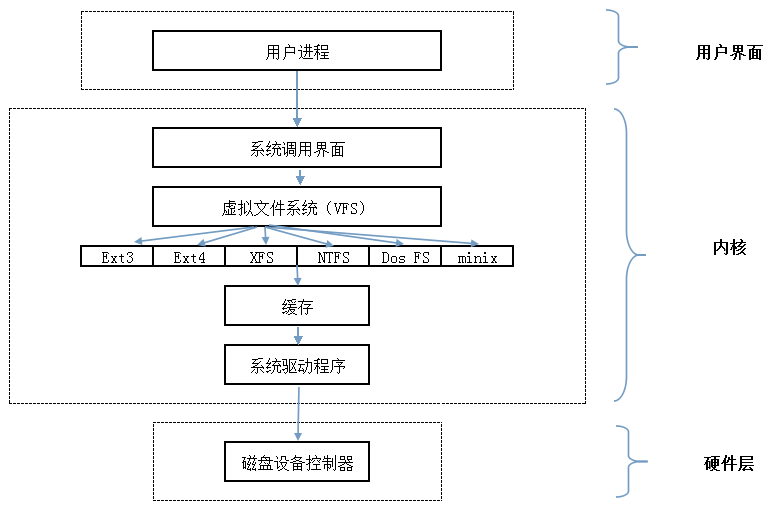

#### 文件系统与磁盘

在Linux中,有句话叫做Linux的一切皆文件.

Linux 中的各种事物比如像文档、目录（Mac OS X 和 Windows 系统下称之为文件夹）、键盘、监视器、硬盘、可移动媒体设备、打印机、调制解调器、虚拟终端，还有进程间通信（IPC）和网络通信等输入或者输出资源都是定义在文件系统空间下的字节流。

在操作系统中, 为了解决信息能独立于进程之外被长期存储引入了文件，文件作为进程创建信息的逻辑单元可被多个进程并发使用。在 UNIX 系统中，操作系统为磁盘上的文本与图像、鼠标与键盘等输入设备及网络交互等 I/O 操作设计了一组通用 API，使他们被处理时均可统一使用字节流方式。换言之，UNIX 系统中除进程之外的一切皆是文件，而 Linux 保持了这一特性。为了便于文件的管理，Linux 还引入了目录（有时亦被称为文件夹）。目录使文件可被分类管理，且目录的引入使 Linux 的文件系统形成一个层级结构的目录树.


Linux系统中的一切文件都是从“根（/）”目录开始的，并按照文件系统层次化标准（FHS）采用树形结构来存放文件，以及定义了常见目录的用途。另外，Linux系统中的文件和目录名称是严格区分大小写的。例如，root、rOOt、Root、rooT均代表不同的目录，并且文件名称中不得包含斜杠（/）。

<p align="center">

</p>

Linux系统中常见的目录名称以及相应内容

|目录名称|应放置文件的内容|
| ---- | ------------------------------- |
|/boot|开机所需文件—内核、开机菜单以及所需配置文件等|
|/dev| 以文件形式存放任何设备与接口|
|/etc|配置文件|
|/home|用户主目录|
|/bin|存放单用户模式下还可以操作的命令|
|/lib|开机时用到的函数库，以及/bin与/sbin下面的命令要调用的函数|
|/sbin|开机过程中需要的命令|
|/media|用于挂载设备文件的目录|
|/opt|放置第三方的软件|
|/root|系统管理员的家目录|
|/srv|一些网络服务的数据文件目录|
|/tmp|任何人均可使用的“共享”临时目录|
|/proc|虚拟文件系统，例如系统内核、进程、外部设备及网络状态等|
|/usr/local|用户自行安装的软件|
|/usr/sbin|Linux系统开机时不会使用到的软件/命令/脚本|
|/usr/share|帮助与说明文件，也可放置共享文件|
|/var|主要存放经常变化的文件，如日志|
|/lost+found|当文件系统发生错误时，将一些丢失的文件片段存放在这里|

#### linux中的文件类型

普通文件:

linux中，类似mp4、pdf、html这样应用层面上的文件类型都属于普通文件Linux用户可以根据访问权限对普通文件进行查看、更改和删除.

* 目录文件（d，directory file）

目录文件对于用惯Windows的用户来说不太容易理解，目录也是文件的一种目录文件包含了各自目录下的文件名和指向这些文件的指针，打开目录事实上就是打开目录文件，只要有访问权限，你就可以随意访问这些目录下的文件（普通文件的执行权限就是目录文件的访问权限），但是只有内核的进程能够修改它们虽然不能修改，但是我们能够通过vim去查看目录文件的内容.

* 符号链接（l，symbolic link）

这种类型的文件类似Windows中的快捷方式，是指向另一个文件的间接指针，也就是我们常说的软链接.

* 块设备文件（b，block）和字符设备文件（c，char）

这些文件一般隐藏在`/dev`目录下，在进行设备读取和外设交互时会被使用到比如磁盘光驱就是块设备文件，串口设备则属于字符设备文件系统中的所有设备要么是块设备文件，要么是字符设备文件，无一例外.

* FIFO（p，pipe）

管道文件主要用于进程间通讯。比如使用mkfifo命令可以创建一个FIFO文件，启用一个进程A从FIFO文件里读数据，启动进程B往FIFO里写数据，先进先出，随写随读。

* 套接字（s，socket）

用于进程间的网络通信，也可以用于本机之间的非网络通信这些文件一般隐藏在/var/run目录下，证明着相关进程的存在
Linux 的文件是没有所谓的扩展名的，一个 Linux文件能不能被执行与它是否可执行的属性有关，只要你的权限中有 x ，比如[-rwx-r-xr-x] 就代表这个文件可以被执行，与文件名没有关系。跟在 Windows下能被执行的文件扩展名通常是 `.com` ,`.exe` `.bat` 等不同。

#### 文件系统与数据资料

用户在硬件存储设备中执行的文件建立、写入、读取、修改、转存与控制等操作都是依靠文件系统来完成的。文件系统的作用是合理规划硬盘，以保证用户正常的使用需求。

Linux系统支持数十种的文件系统，而最常见的文件系统都有哪些呢?

Ext3：是一款日志文件系统，能够在系统异常宕机时避免文件系统资料丢失，并能自动修复数据的不一致与错误。然而，当硬盘容量较大时，所需的修复时间也会很长，而且也不能百分之百地保证资料不会丢失。它会把整个磁盘的每个写入动作的细节都预先记录下来，以便在发生异常宕机后能回溯追踪到被中断的部分，然后尝试进行修复。

Ext4：Ext3的改进版本，作为RHEL 6系统中的默认文件管理系统，它支持的存储容量高达1EB（1EB=1,073,741,824GB），且能够有无限多的子目录。另外，Ext4文件系统能够批量分配block块，从而极大地提高了读写效率。

XFS：是一种高性能的日志文件系统，而且是RHEL 7中默认的文件管理系统，它的优势在发生意外宕机后尤其明显，即可以快速地恢复可能被破坏的文件，而且强大的日志功能只用花费极低的计算和存储性能。并且它最大可支持的存储容量为18EB，这几乎满足了所有需求。


日常在硬盘需要保存的数据实在太多了，因此Linux系统中有一个名为super block的“硬盘地图”。Linux并不是把文件内容直接写入到这个“硬盘地图”里面，而是在里面记录着整个文件系统的信息。因为如果把所有的文件内容都写入到这里面，它的体积将变得非常大，而且文件内容的查询与写入速度也会变得很慢。Linux只是把每个文件的权限与属性记录在inode中，而且每个文件占用一个独立的inode表格，该表格的大小默认为128字节，里面记录着如下信息：

```markdown
该文件的访问权限（read、write、execute）；

该文件的所有者与所属组（owner、group）；

该文件的大小（size）；

该文件的创建或内容修改时间（ctime）；

该文件的最后一次访问时间（atime）；

该文件的修改时间（mtime）；

文件的特殊权限（SUID、SGID、SBIT）；

该文件的真实数据地址（point）。
```

而文件的实际内容则保存在block块中（大小可以是1KB、2KB或4KB），一个inode的默认大小仅为128B（Ext3），记录一个block则消耗4B。当文件的inode被写满后，Linux系统会自动分配出一个block块，专门用于像inode那样记录其他block块的信息，这样把各个block块的内容串到一起，就能够让用户读到完整的文件内容了。对于存储文件内容的block块，有下面两种常见情况（以4KB的block大小为例进行说明）。

```markdown
情况1：文件很小（1KB），但依然会占用一个block，因此会潜在地浪费3KB。

情况2：文件很大（5KB），那么会占用两个block（5KB-4KB后剩下的1KB也要占用一个block）。
```

计算机系统在发展过程中产生了众多的文件系统，为了使用户在读取或写入文件时不用关心底层的硬盘结构，Linux内核中的软件层为用户程序提供了一个VFS（Virtual File System，虚拟文件系统）接口，这样用户实际上在操作文件时就是统一对这个虚拟文件系统进行操作了。下图中VFS的架构示意图。从中可见，实际文件系统在VFS下隐藏了自己的特性和细节，这样用户在日常使用时会觉得“文件系统都是一样的”，也就可以随意使用各种命令在任何文件系统中进行各种操作了（比如使用cp命令来复制文件）。

<p align="center">

</p>

#### 机械硬盘的物理存储机制

计算机大部分文件存储功能都是由机械硬盘这种设备提供的。（现在的SSD和闪存从概念和逻辑上都部分继承自机械硬盘，所以使用机械硬盘来进行理解也是没有问题的）机械硬盘能实现信息存储的功能基于：磁性存储介质能够被磁化，且磁化后会长久保留被磁化的状态，这种被磁化状态能够被读取出来，同时这种磁化状态还能够不断被修改，磁化正好有两个方向，所以可以表示0和1。

硬盘其实就是把这种磁性存储介质做成一个个盘片，每一个盘片上都分布着数量巨大的磁性存储单位，使用磁性读写头对盘片进行写入和读取（从原理上类似黑胶唱片的播放）。

一个硬盘中的磁性存储单位数以亿计（1T硬盘就有约80亿个），所以需要一套规则来规划信息如何存取（比如一本存储信息的书我们还会分为页，每一页从上到下从左到右读取，同时还有章节目录）于是就有了这些物理、逻辑概念：
```markdown
   
一个硬盘有多张盘片叠成，不同盘片有编号.
每张盘片上的存储颗粒成环形一圈圈地排布，每一圈称为磁道，有编号,每条磁道上都有一圈存储颗粒，每512*8（512字节，0.5KB）个存储颗粒作为一个扇区，扇区是硬盘上存储的最小物理单位 ,N个扇区可以组成簇，N取决于不同的文件系统或是文件系统的配置，簇是此文件系统中的最小存储单位,所有盘面上的同一磁道构成一个圆柱，称为柱面，柱面是系统分区的最小单位.
```
磁头读写文件的时候，首先是分区读写的，由inode编号（区内唯一的编号后面介绍）找到对应的磁道和扇区，然后一个柱面一个柱面地进行读写。机械硬盘的读写控制系统是一个令人叹为观止的精密工程（一个盘面上有几亿个存储单位，每个磁道宽度不到几十纳米，磁盘每分钟上万转）.

有了硬盘并不意味着linux可以立刻把它用来存储，还需要组合上面的Linux的文件体系才能被Linux使用。


#### 硬盘分区

硬盘分区是硬盘结合到文件体系的第一步，本质是硬盘这个物理概念转换成区这个逻辑概念，为下一步格式化做准备。所以分本身并不是必须的，你完全可以把一整块硬盘作为一个区。但从数据的安全性以及系统性能角度来看，分区还是有很多用处的，所以一般都会对硬盘进行分区。


提高了分区就不得不先提每块硬盘上最重要的第一扇区，这个扇区中有硬盘主引导记录(Master boot record, MBR) 及分区表(partition table)， 其中 MBR 占有 446 bytes，而分区表占有 64 bytes。硬盘主引导记录放有最基本的引导加载程序，是系统开机启动的关键环节，在附录中有更详细的说明。而分区表则跟分区有关，它记录了硬盘分区的相关信息，但因分区表仅有 64bytes ， 所以最多只能记彔四块分区（分区本身其实就是对分区表进行设置）。


但是如果只能分四个区就实在太少了，所以就有了扩展分区的概念，既然第一个扇区所在的分区表只能记录四条数据， 那我可否利用额外的扇区来记录更多的分区信息。

把普通可以访问的分区称为主分区，扩展分区不同于主分区，它本身并没有内容，它是为进一步逻辑分区提供空间的。在某块分区指定为扩展分区后，就可以对这块扩展分区进一步分成多个逻辑分区。

操作系统规定：

* 四块分区每块都可以是主分区或扩展分区.
* 扩展分区最多只能有一个（也没必要有多个）.
* 扩展分区可以进一步分割为多个逻辑分区.
* 扩展分区只是逻辑概念，本身不能被访问，也就是不能被格式化后作为数据访问的分区，能够作为数据访问的分区只有主分区和逻辑分区.
* 逻辑分区的数量依操作系统而不同，在 Linux 系统中，IDE 硬盘最多有 59 个逻辑分区(5 号到 63 号)， SATA 硬盘则有 11 个逻辑分区(5 号到 15 号)一般给硬盘进行分区时，一个主分区一个扩展分区，然后把扩展分区划分为N个逻辑分区是最好的.

这里需要特别提到的是,swap区（内存置换空间），它独为一类，功能是：当有数据被存放在物理内存里面，但是这些数据又不是常被 CPU 所取用时，那么这些不常被使用的程序将会被丢到硬盘的 swap 置换空间当中， 而将速度较快的物理内存空间释放出来给真正需要的程序使用.


