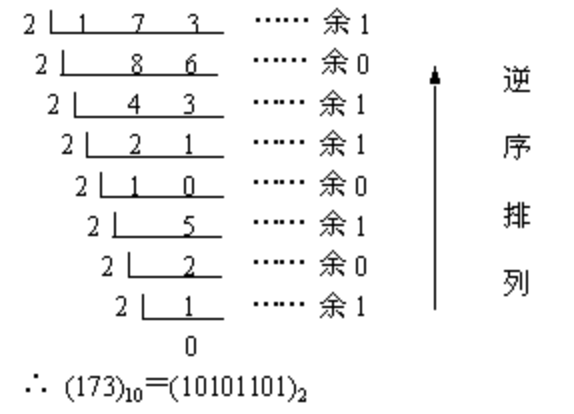
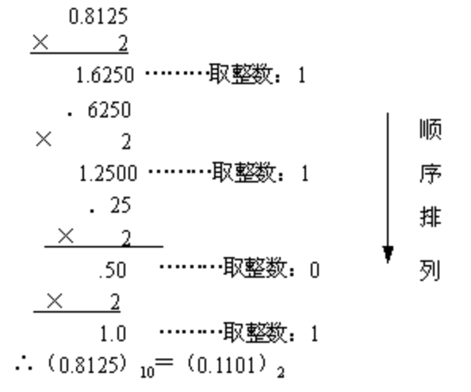
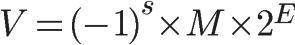
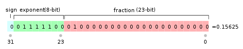
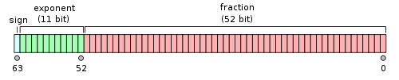

#### 浮点数在计算机中是如何存储

最近看了很多关于计算机底层的一些书,我们都知道计算机里运算的是二进制,但是在程序中却是十进制整数,或者十进制的小数,那么他们是如何转换的那,浮点数又是如何在计算机存储的呢?

#### 十进制整数转二进制

十进制整数转换为二进制整数采用"除2取余，逆序排列"法。具体做法是：用2去除十进制整数，可以得到一个商和余数；再用2去除商，又会得到一个商和余数，如此进行，直到商为零时为止，然后把先得到的余数作为二进制数的低位有效位，后得到的余数作为二进制数的高位有效位，依次排列起来。

具体做法是：

1. 用2整除十进制整数，可以得到一个商和余数；
2. 再用2去除商，又会得到一个商和余数，如此进行，直到商为0时为止
3. 然后把先得到的余数作为二进制数的低位有效位，后得到的余数作为二进制数的高位有效位，依次排列起来。
4. 例如 5 的二进制表示为：101

```markdown
5 / 2 => 商2 余 1
2 / 2 => 商1 余 0
1 / 2 => 商0 余 1
```

我们在看一个把173 十进制转换为二进制数。

<p align="center">

</p>


#### 二进制转十进制整数

如何一个二进制转换为十进制的整数,那么就需要用二进制数从右向左的每个位上数去乘以2的相应次方，并将所有结果相加。例如5的二进制是：101

```markdown
1 * 2^0 = 1
0 * 2^1 = 0
1 * 2^2 = 4
```

然后`1 + 0 + 4 = 5`

#### 二进制小数转换成十进制

二进制转换成十进制的基本做法是：将二进制数首先写成加权系数展开式，然后按十进制加法规则求和，按权相加。

我们看一个1101.01的二进制小数转换成十进制小数的.

```markdown
（1101.01）B 转换成十进制的小数

1*(2^3) + 1*(2^2) + 0*(2^1) + 1*(2^0) + 0*(2^ -1) + 1*(2^ -2)

= 8 + 4 + 0 +1 + 0 + 0.25

= 13.25
```

#### 十进制小数转换为二进制小数

十进制小数转换成二进制小数采用"乘2取整，顺序排列"法。

具体做法是：用2乘十进制小数，可以得到积，将积的整数部分取出，再用2乘余下的小数 部分，又得到一个积，再将积的整数部分取出，如此进行，直到积中的小数部分为零，或者达到所要求的精度为止。

然后把取出的整数部分按顺序排列起来，先取的整数作为二进制小数的高位有效位，后取的整数作为低位有效位。


我们在看一个把0.8125十进制小数转换为二进制数。

<p align="center">

</p>

但是这里有个问题是不是所有的十进制小数都能转换有限位数的二进制小数。例如10进制0.2的2进制：

```markdown
0.2 x 2 0.4 0
0.4 x 2 0.8 0
0.8 x 2 1.6 1
0.6 x 2 1.2 1
0.2 x 2 0.4 0
0.4 x 2 0.8 0
0.8 x 2 1.6 1
0.6 x 2 1.2 1
......
```
发现了吗? 它是乘不尽的，是无限循环（0011）的……

在计算机中，浮点数没有办法精确表示的根本原因在于计算机有限的内存无法表示无限的小数位。因此呢只能截断，截断就造精度的缺失。

0.2 的二进制小数表示可以是：
```markdown
0.2 = 0.00110011
```

转为十进制为：1/8 + 1/16 + 1/128 + 1/256 = 0.19921875

已经很接近了，如果需要更精确的表示，只需要保留更长的有效位数。这也是双精度的double比单精度的float更精确的原因。

那计算机究竟是如何保存二进制小数的呢？这个就不得不提 [IEEE 754](https://zh.wikipedia.org/wiki/IEEE_754) 规范了。详细可以去查看下 [IEEE 754](https://zh.wikipedia.org/wiki/IEEE_754) .

#### 浮点数存储

IEEE754规范:

一个浮点数 (Value) 的表示其实可以这样表示：
<p align="center">

</p>


<p align="center">

</p>

浮点数的实际值，等于符号位（sign bit）乘以指数偏移值(exponent bias)再乘以分数值(fraction)。

也就是说一个二进制浮点数存储分为三个部分：

* 符号位S
* 指数位部分
* 尾数位部分

举个例子：十进制浮点数1.8125的二进制形式为1.1101 用二进制科学计数法可以表示为1.1101 * 2^0

那么可以推出任意一个二进制浮点数V可以表示成下面的形式：
<p align="center">

</p>

* (-1)^S表示符号位，当s=0，V为正数；当s=1，V为负数。
* M表示有效数字，大于等于1，小于2。
* 2^E表示指数位。

举例来说，十进制的`5.0`，写成二进制是`101.0`，相当于1.01×2^2。那么，按照上面V的格式，可以得出`S=0，M=1.01，E=2`。

十进制的`-5.0`，写成二进制是`-101.0`，相当于`-1.01×2^2`。那么，`S=1，M=1.01，E=2`。


#### 32和64位浮点数

IEEE 754规定，对于32位的浮点数，最高的1位是符号位S，接着的8位是指数E，剩下的23位为有效数字M。

<p align="center">

</p>

对于64位的浮点数，最高的1位是符号位S，接着的11位是指数E，剩下的52位为有效数字M。

<p align="center">

</p>

IEEE 754对指数E和有效数字M还有一些特别规定:

* 指数偏移值
  
指数偏移值（exponent bias），是指浮点数表示法中的`指数域`的编码值为指数的实际值加上某个固定的值，`IEEE 754`标准规定该固定值为`2^{e-1}-1`，其中的e为存储指数的比特位的长度（float为8，double为11）。
以单精度浮点数为例，它的指数域是8个比特，固定偏移值是 `2^{8-1}-1=128-1=127`。单精度浮点数的指数部分实际取值是从-127到128(8位有符号二进制的取值范围)。例如指数实际值为`17`，在单精度浮点数中的指数域编码值为`144`，即`127 + 17`。
采用指数的实际值加上固定的偏移值的办法表示浮点数的指数，好处是可以用长度为`e`个比特的无符号整数来表示所有的指数取值，这使得两个浮点数的指数大小的比较更为容易，实际上可以按照字典序比较两个浮点表示的大小。

* 规约形式的浮点数
  
如果浮点数中指数部分的编码值在`0<exponent<2^e-2`之间，且尾数部分最高有效位（即整数字)是`1`，那么这个浮点数将被称为规约形式的浮点数。”规约”是指用唯一确定的浮点形式去表示一个值。

由于这种表示下的尾数有一位隐含的二进制有效数字，为了与二进制科学计数法的尾数（mantissa）相区别，IEEE754称之为有效数（significant）。


* 特殊值

这里有三个特殊值需要指出：

1. 如果指数是0并且尾数的小数部分是0，这个数是±0（和符号位相关）.
2. 如果指数 = 2^e-1并且尾数的小数部分是0，这个数是±∞（同样和符号位相关）.
3. 如果指数 = 2^e-1并且尾数的小数部分非0，这个数表示为不是一个数（NaN）.

因此就会有:

|形式	|指数	|小数部分|
|-------|-------|------|
|零	|0	|0|
|非规约形式|	0 |	非0 |
|规约形式	|1 - 2^e-2 |任意|
|无穷	|2^e - 1   |0 |  
|NaN	|2^e - 1   |非零| 

* 32位单精度

32位浮点数取值范围


|类别 |	正负号|	实际指数 |	有偏移指数|	指数域|	尾数域|	数值|
|----|-------|----------|-----------|--------|-------|------|
|零 |	0|	-127|	0 |	0000 0000|	000 0000 0000 0000 0000  0000|0.0|
|负零|	1	|-127 |	0 |	0000 0000|	000 0000 0000 0000 0000  0000	|−0.0|
|1	|0	|0	|127  |	0111 1111 |000 0000 0000 0000 0000 0000|1.0 |
|-1	|1	|0	|127  |	0111  1111 |000 0000 0000 0000 0000 0000 |−1.0 |
|最小的非规约数|	* |	-126|	0 |	0000 0000	|000 0000 0000 0000 0000 | 0001	±2−23 × 2−126 = ±2−149 ≈ ±1.4×10-45|
|中间大小的非规约数	|* |-126|	0 |	0000 0000	|100 0000 0000 0000 0000 0000 |	±2−1 × 2−126 = ±2−127 ≈ ±5.88×10-39|
|最大的非规约数|	*  |-126|	0 |	0000 0000	|111 1111 1111 1111 1111 1111 |	±(1−2−23) × 2−126 ≈ ±1.18×10-38|
|最小的规约数|	* |	-126|	1 |	0000 0001	|000 0000 0000 0000 0000 0000 |	±2−126 ≈ ±1.18×10-38|
|最大的规约数|	* |	127	|254  |	1111 1110 | 111 1111 1111 1111  1111 1111 |	±(2−2−23) × 2127 ≈ ±3.4×1038|
|正无穷|	0  |	128	|255| 1111 1111|	000 0000 0000 0000 0000 0000|	+∞|
|负无穷|	1  |	128	|255| 1111 1111|	000 0000 0000 0000 0000 0000 |	−∞|
|NaN|	*  |	128	|255| 1111 1111|	non |zero|	NaN|
|* 符号位可以为0或1 . |

#### 64位双精度

双精度二进制小数，使用64个比特存储。


|1 |11|52位长|
|--|--|-----|
|S |	Exp	Fraction |
|63|	62至52偏正值（实际的指数大小+1023）|	51至0位编号（从右边开始为0）|

S为符号位，Exp为指数字，Fraction为有效数字。指数部分即使用所谓的偏正值形式表示，偏正值为实际的指数大小与一个固定值（64位的情况是1023）的和。采用这种方式表示的目的是简化比较。因为，指数的值可能为正也可能为负，如果采用补码表示的话，全体符号位S和Exp自身的符号位将导致不能简单的进行大小比较。正因为如此，指数部分通常采用一个无符号的正数值存储。双精度的指数部分是−1022～+1023加上1023，指数值的大小从1～2046（0（2进位全为0）和2047（2进位全为1）是特殊值）。浮点小数计算时，指数值减去偏正值将是实际的指数大小。

浮点数的比较:

浮点数基本上可以按照符号位、指数域、尾数域的顺序作字典比较。显然，所有正数大于负数；正负号相同时，指数的二进制表示法更大的其浮点数值更大。

#### 为什么0x00000009还原成浮点数，就成了0.000000？

首先，将`0x00000009`拆分，得到第一位符号位`s=0`，后面8位的指数`E=00000000`，最后23位的有效数字`M=000 0000 0000 0000 0000 1001`。
由于指数E全为0，所以符合上一节的第二种情况。因此，浮点数V就写成：

```markdown
V=(−1)0×0.00000000000000000001001×2−126=1.001×2−146
```
显然，V是一个很小的接近于0的正数，所以用十进制小数表示就是0.000000。


那么浮点数9.0，如何用二进制表示？还原成十进制又是多少？

首先，浮点数9.0等于二进制的`1001.0`，即`1.001×2^3`。
那么，第一位的符号位`s=0`，有效数字M等于`001`后面再加20个0，凑满23位，指数E等于`3+127=130`，即`10000010`。
所以，写成二进制形式，应该是s+E+M，即`0 10000010 001 0000 0000 0000 0000 0000`。这个32位的二进制数，还原成十进制，正是`1091567616`。


#### 浮点数的舍入

任何有效数上的运算结果，通常都存放在较长的寄存器中，当结果被放回浮点格式时，必须将多出来的比特丢弃。 有多种方法可以用来运行舍入作业，实际上IEEE标准列出4种不同的方法：

* 舍入到最接近：舍入到最接近，在一样接近的情况下偶数优先（Ties To Even，这是默认的舍入方式）：会将结果舍入为最接近且可以表示的值，但是当存在两个数一样接近的时候，则取其中的偶数（在二进制中是以0结尾的）。
* 朝+∞方向舍入：会将结果朝正无限大的方向舍入。
* 朝-∞方向舍入：会将结果朝负无限大的方向舍入。
* 朝0方向舍入：会将结果朝0的方向舍入。
