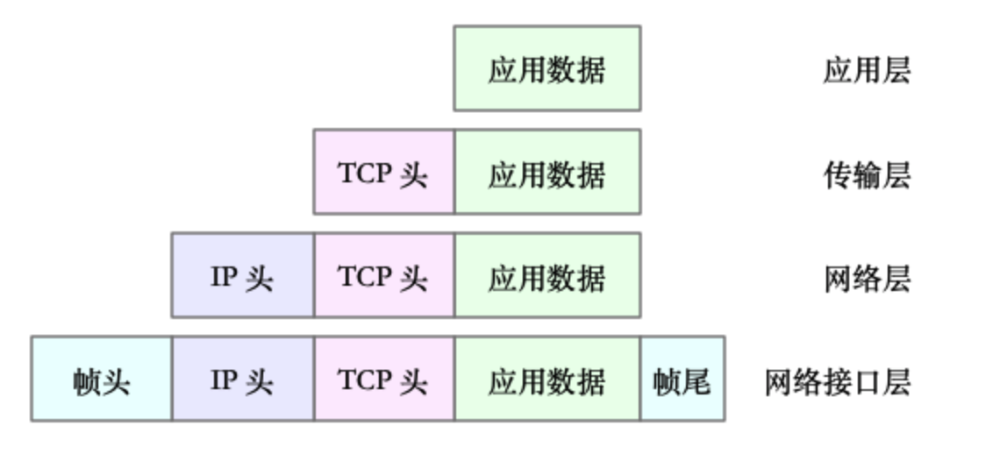
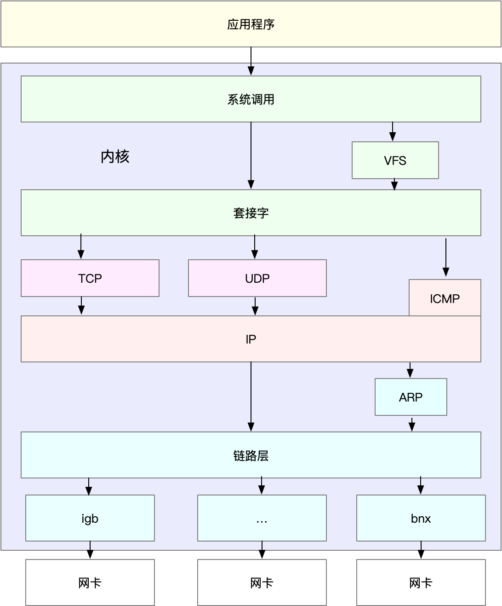
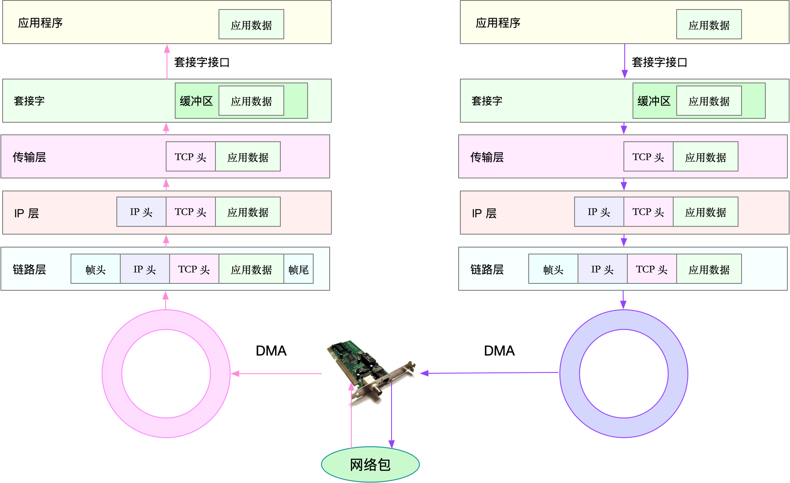

#### linux网络模型

开放系统互连参考模型 (Open System Interconnect 简称OSI）是国际标准化组织(ISO)和国际电报电话咨询委员会(CCITT)联合制定的开放系统互连参考模型，为开放式互连信息系统提供了一种功能结构的框架。它从低到高分别是：物理层、数据链路层、网络层、传输层、会话层、表示层和应用层。

OSI 网络模型:

1. 应用层，负责为应用程序提供统一的接口。

2. 表示层，负责把数据转换成兼容接收系统的格式。

3. 会话层，负责维护计算机之间的通信连接。

4. 传输层，负责为数据加上传输表头，形成数据包。

5. 网络层，负责数据的路由和转发。

6. 数据链路层，负责 MAC 寻址、错误侦测和改错。

7. 物理层，负责在物理网络中传输数据帧。

OSI参考模型的全称是开放系统互连参考模型，是由国际标准化组织ISO在20世纪80年代初提出来的。ISO自从1946年成立以来，已经提出了多个标准，而`ISO/IEC 7498`，这个关于网络体系结构的标准定义了网络互连的基本参考模型。当时，网络界出现了以IBM的SNA为代表的若干个网络体系结构，这些体系结构的着眼点往往是各公司内部的网络连接，没有统一的标准，因而它们之间很难互连起来。在这种情况下，ISO提出了OSI参考模型，它最大的特点是开放性。不同厂家的网络产品，只要遵照这个参考模型，就可以实现互连、互操作和可移植性。也就是说，任何遵循OSI标准的系统，只要物理上连接起来，它们之间都可以互相通信。

OSI参考模型定义了开放系统的层次结构和各层所提供的服务。OSI参考模型的一个成功之处在于，它清晰地分开了服务、接口和协议这3个容易混淆的概念。服务描述了每一层的功能，接口定义了某层提供的服务如何被高层访问，而协议是每一层功能的实现方法。通过区分这些抽象概念，OSI参考模型将功能定义与实现细节区分开来，概括性高，使它具有普遍的适应能力。

OSI参考模型是具有7个层次的框架，自底向上的7个层次分别是物理层、数据链路层、网络层、传输层、会话层、表示层和应用层。

对于linux网络模型,OSI 模型还是太复杂了，也没提供一个可实现的方法。因此在 Linux 中，实际上使用的是另一个更实用的四层模型，即 `TCP/IP` 网络模型。 `TCP/IP` 模型，把网络互联的框架分为应用层、传输层、网络层、网络接口层等四层.

TCP/IP 模型:

* 应用层，负责向用户提供一组应用程序，比如 HTTP、FTP、DNS 等。

* 传输层，负责端到端的通信，比如 TCP、UDP 等。

* 网络层，负责网络包的封装、寻址和路由，比如 IP、ICMP 等。

* 网络接口层，负责网络包在物理网络中的传输，比如 MAC 寻址、错误侦测以及通过网卡传输网络帧等。

Linux 实际按照 `TCP/IP` 模型，实现了网络协议栈，通常我们还是习惯用 OSI 七层模型来描述。比如，说到七层和四层负载均衡，对应的分别是 OSI 模型中的应用层和传输层（而它们对应到 TCP/IP 模型中，实际上是四层和三层）。

<p align="center">

</p>

* 传输层在应用程序数据前面增加了 TCP 头.
* 网络层在 TCP 数据包前增加了 IP 头.
* 网络接口层，又在 IP 数据包前后分别增加了帧头和帧尾.

接着我们可以看下, Linux 内核中的网络栈.

<p align="center">

</p>

* 最上面的的应用程序，需要通过系统调用，来跟套接字接口进行交互.
* 套接字的下面，就是我们前面提到的传输层、网络层和网络接口层.
* 最底层，则是网卡驱动程序以及物理网卡设备.

网卡是发送和接收网络包的基本设备。在系统启动过程中，网卡通过内核中的网卡驱动程序注册到系统中。而在网络收发过程中，内核通过中断跟网卡进行交互。再结合前面提到的 Linux 网络栈，可以看出，网络包的处理非常复杂。所以，网卡硬中断只处理最核心的网卡数据读取或发送，而协议栈中的大部分逻辑，都会放到软中断中处理。

网络包如何接受?

当一个网络帧到达网卡后，网卡会通过 `DMA` 方式，把这个网络包放到收包队列中；然后通过硬中断，告诉中断处理程序已经收到了网络包。接着，网卡中断处理程序会为网络帧分配内核数据结构（`sk_buff`），并将其拷贝到 `sk_buff` 缓冲区中；然后再通过软中断，通知内核收到了新的网络帧。

<p align="center">

</p>

网络包的发送:

应用程序调用 `Socket API`（比如 sendmsg）发送网络包。 由于这是一个系统调用，所以会陷入到内核态的套接字层中。套接字层会把数据包放到 Socket 发送缓冲区中。 接下来，网络协议栈从 Socket 发送缓冲区中，取出数据包；再按照 TCP/IP 栈，从上到下逐层处理。比如，传输层和网络层，分别为其增加 TCP 头和 IP 头，执行路由查找确认下一跳的 IP，并按照 MTU 大小进行分片。 分片后的网络包，再送到网络接口层，进行物理地址寻址，以找到下一跳的 MAC 地址。然后添加帧头和帧尾，放到发包队列中。这一切完成后，会有软中断通知驱动程序：发包队列中有新的网络帧需要发送。 最后，驱动程序通过 DMA ，从发包队列中读出网络帧，并通过物理网卡把它发送出去。


#### 性能指标

通常用带宽、吞吐量、延时、PPS（Packet Per Second）等指标衡量网络的性能。

* 带宽，表示链路的最大传输速率，单位通常为 `b/s` （比特 / 秒）。

* 吞吐量，表示单位时间内成功传输的数据量，单位通常为 `b/s`（比特 / 秒）或者 `B/s`（字节 / 秒）。吞吐量受带宽限制，而吞吐量 / 带宽，也就是该网络的使用率。

* 延时，表示从网络请求发出后，一直到收到远端响应，所需要的时间延迟。。

* PPS，是 `Packet Per Second`（包 / 秒）的缩写，表示以网络包为单位的传输速率。PPS 通常用来评估网络的转发能力。

除了这些指标，网络的可用性（网络能否正常通信）、并发连接数（TCP 连接数量）、丢包率（丢包百分比）、重传率（重新传输的网络包比例）等也是常用的性能指标。


网络配置命令:

* ifconfig.
* ip.
* ss.
* netstat.

```bash
> netstat -tunlp |grep 10900
```

* sar 可以使用sar命令查看一个月以内的内存使用情况。
```bash
> sar -u
```

* ping
```bash
> ping www.baidu.com
```

#### 那么四层负载均衡和七层负载均衡区别在哪里？

通常, 在API Gateway前置一层接入层，接入层主要用于实现限流、黑白名单、负载均衡等功能。其中选择负载均衡有两种方案:选用四层负载均衡还是七层负载均衡呢？四层与七层的主要区别在哪里呢？

* 从技术实现原理上

四层负载均衡其实是,使用IP加端口的方式进行路由转发；七层负载均衡一般是基于请求URL地址的方式进行代理转发。同理，还有基于MAC地址信息(虚拟MAC地址到真实MAC地址)进行转发的二层负载均衡和基于IP地址(虚拟IP到真实IP)的三层负载均衡。(四层直接转发效率高,七层是在应用层的转发)

四层负载均衡具体实现方式为：通过报文中的IP地址和端口，再加上负载均衡设备所采用的负载均衡算法，最终确定选择后端哪台下游服务器。以TCP为例，客户端向负载均衡发送SYN请求建立第一次连接，通过配置的负载均衡算法选择一台后端服务器，并且将报文中的IP地址信息修改为后台服务器的IP地址信息，因此TCP三次握手连接是与后端服务器直接建立起来的。

七层服务均衡在应用层选择服务器，只能先与负载均衡设备进行TCP连接，然后负载均衡设备再与后端服务器建立另外一条TCP连接通道。因此，七层设备在网络性能损耗会更多一些。

* 从安全视角上

四层负载均衡与服务器直接建立起TCP连接，很容易遭受SYN Flood攻击。SYN Flood是一种广为人知的DDoS（分布式拒绝服务攻击）的方式之一，这是一种利用TCP协议缺陷，发送大量伪造的TCP连接请求，从而使得被攻击方资源耗尽的攻击方式。从技术实现原理上可以看出，四层负载均衡很容易将垃圾流量转发至后台服务器，而七层设备则可以过滤这些恶意并清洗这些流量，但要求设备本身具备很强的抗DDOS流量的能力。


* 常见四层和七层负载均衡包括

四层: F5、LVS等

七层: nginx、apache.
