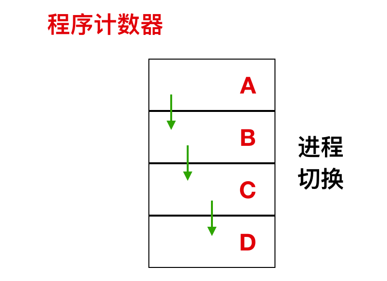
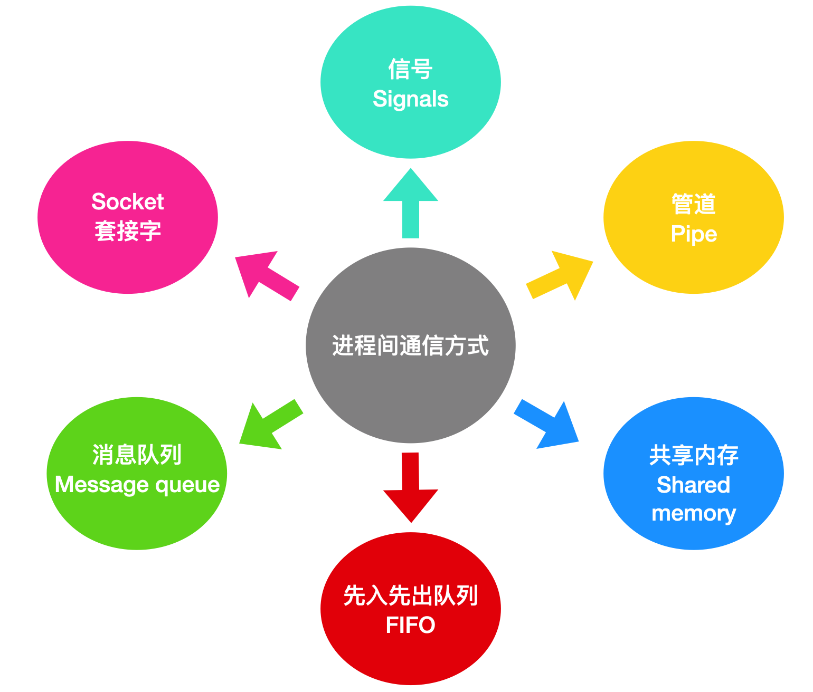
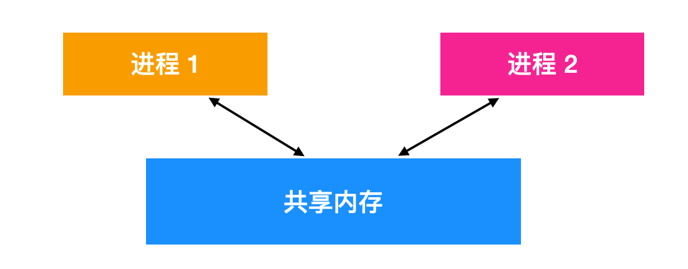
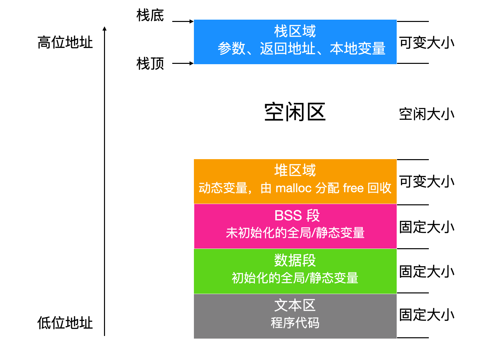

#### linux进程和线程

在linux中, 每个进程都会运行一段独立的程序，并且在初始化的时候拥有一个独立的控制线程。换句话说，每个进程都会有一个自己的程序计数器，这个程序计数器用来记录下一个需要被执行的指令。Linux 允许进程在运行时创建额外的线程。

<p align="center">

</p>

Linux 是一个多道程序设计系统，因此系统中存在彼此相互独立的进程同时运行。此外，每个用户都会同时有几个活动的进程。因为如果是一个大型系统，可能有数百上千的进程在同时运行。

在某些用户空间中，即使用户退出登录，仍然会有一些后台进程在运行，这些进程被称为 守护进程(daemon)。

Linux 中有一种特殊的守护进程被称为 计划守护进程(Cron daemon) ，计划守护进程可以每分钟醒来一次检查是否有工作要做，做完会继续回到睡眠状态等待下一次唤醒。

```markdown
Cron 是一个守护程序，可以做任何你想做的事情，比如说你可以定期进行系统维护、定期进行系统备份等。在其他操作系统上也有类似的程序，比如 Mac OS X 上 Cron 守护程序被称为 launchd 的守护进程。在 Windows 上可以被称为 计划任务(Task Scheduler)。
```

在 Linux 系统中，进程通过简单的方式来创建，fork 系统调用会创建一个源进程的拷贝(副本)。调用 fork 函数的进程被称为 父进程(parent process)，使用 fork 函数创建出来的进程被称为 子进程(child process)。父进程和子进程都有自己的内存映像。如果在子进程创建出来后，父进程修改了一些变量等，那么子进程是看不到这些变化的，也就是 fork 后，父进程和子进程相互独立。

虽然父进程和子进程保持相互独立，但是它们却能够共享相同的文件，如果在 fork 之前，父进程已经打开了某个文件，那么 fork 后，父进程和子进程仍然共享这个打开的文件。对共享文件的修改会对父进程和子进程同时可见。

那么该如何区分父进程和子进程呢？子进程只是父进程的拷贝，所以它们几乎所有的情况都一样，包括内存映像、变量、寄存器等。区分的关键在于 fork  函数调用后的返回值，如果 fork 后返回一个非零值，这个非零值即是子进程的 进程标识符(Process Identiier, PID).

父进程在 fork 后会得到子进程的 PID，这个 PID 即能代表这个子进程的唯一标识符也就是 PID。如果子进程想要知道自己的 PID，可以调用 getpid 方法。当子进程结束运行时，父进程会得到子进程的 PID，因为一个进程会 fork 很多子进程，子进程也会 fork 子进程，所以 PID 是非常重要的.

#### Linux 进程间通信

Linux 进程间的通信机制通常被称为 Internel-Process communication,IPC ,在Linux中进程间的通信机制可以分为 6 种.

<p align="center">

</p>

#### 信号 signal

信号是 UNIX 系统最先开始使用的进程间通信机制，因为 Linux 是继承于 UNIX 的，所以 Linux 也支持信号机制，通过向一个或多个进程发送异步事件信号来实现，信号可以从键盘或者访问不存在的位置等地方产生；信号通过 `shell` 将任务发送给子进程。

在 `Linux` 系统上输入 `kill -l` 来列出系统使用的信号:

```bash
> kill -l
HUP INT QUIT ILL TRAP ABRT EMT FPE KILL BUS SEGV SYS PIPE ALRM TERM URG STOP TSTP CONT CHLD TTIN TTOU IO XCPU XFSZ VTALRM PROF WINCH INFO USR1 USR2
```

进程可以选择忽略发送过来的信号，但是有两个是不能忽略的：`SIGSTOP` 和 `SIGKILL` 信号。`SIGSTOP` 信号会通知当前正在运行的进程执行关闭操作，`SIGKILL` 信号会通知当前进程应该被杀死。除此之外，进程可以选择它想要处理的信号，进程也可以选择阻止信号，如果不阻止，可以选择自行处理，也可以选择进行内核处理。如果选择交给内核进行处理，那么就执行默认处理。


操作系统会中断目标程序的进程来向其发送信号、在任何非原子指令中，执行都可以中断，如果进程已经注册了新号处理程序，那么就执行进程，如果没有注册，将采用默认处理的方式。

当进程收到 `SIGFPE` 浮点异常的信号后，默认操作是对其进行 dump(转储)和退出。信号没有优先级的说法。如果同时为某个进程产生了两个信号，则可以将它们呈现给进程或者以任意的顺序进行处理。

接下来详细了解下这些信号:

* SIGABRT 和 SIGIOT

`SIGABRT` 和 `SIGIOT` 信号发送给进程，告诉其进行终止，这个 信号通常在调用 C标准库的abort()函数时由进程本身启动.

* SIGALRM 、SIGVTALRM、SIGPROF

当设置的时钟功能超时时会将 `SIGALRM`、 `SIGVTALRM`、`SIGPROF` 发送给进程。当实际时间或时钟时间超时时，发送 `SIGALRM`。 当进程使用的 CPU 时间超时时，将发送 `SIGVTALRM`。 当进程和系统代表进程使用的CPU 时间超时时，将发送 `SIGPROF`。

* SIGBUS

`SIGBUS` 将造成总线中断错误时发送给进程.

* SIGCHLD

当子进程终止、被中断或者被中断恢复，将 SIGCHLD 发送给进程。此信号的一种常见用法是指示操作系统在子进程终止后清除其使用的资源。

* SIGCONT

SIGCONT 信号指示操作系统继续执行先前由 SIGSTOP 或 SIGTSTP 信号暂停的进程。该信号的一个重要用途是在 Unix shell 中的作业控制中。

* SIGFPE

SIGFPE 信号在执行错误的算术运算（例如除以零）时将被发送到进程。

* SIGUP

当 `SIGUP` 信号控制的终端关闭时，会发送给进程。许多守护程序将重新加载其配置文件并重新打开其日志文件，而不是在收到此信号时退出。

* SIGILL

SIGILL 信号在尝试执行非法、格式错误、未知或者特权指令时发出.

* SIGINT

当用户希望中断进程时，操作系统会向进程发送 SIGINT 信号。用户输入 `ctrl - c` 就是希望中断进程。

* SIGKILL

SIGKILL 信号发送到进程以使其马上进行终止。 与 SIGTERM 和 SIGINT 相比，这个信号无法捕获和忽略执行，并且进程在接收到此信号后无法执行任何清理操作，下面是一些例外情况.

通常僵尸进程无法杀死，因为僵尸进程已经死了，它在等待父进程对其进行捕获, 处于阻塞状态的进程只有再次唤醒后才会被 kill 掉.

init 进程是 Linux 的初始化进程，这个进程会忽略任何信号。

SIGKILL 通常是作为最后杀死进程的信号、它通常作用于 SIGTERM 没有响应时发送给进程。

* SIGPIPE

SIGPIPE 尝试写入进程管道时发现管道未连接无法写入时发送到进程.

* SIGPOLL

当在明确监视的文件描述符上发生事件时，将发送 SIGPOLL 信号。

* SIGRTMIN 至 SIGRTMAX

SIGRTMIN 至 SIGRTMAX 是实时信号.

* SIGQUIT

当用户请求退出进程并执行核心转储时，SIGQUIT 信号将由其控制终端发送给进程。

* SIGSEGV

当 SIGSEGV 信号做出无效的虚拟内存引用或分段错误时，即在执行分段违规时，将其发送到进程。

* SIGSTOP

SIGSTOP 指示操作系统终止以便以后进行恢复时.

* SIGSYS

当 SIGSYS 信号将错误参数传递给系统调用时，该信号将发送到进程。

* SYSTERM

我们上面简单提到过了 SYSTERM 这个名词，这个信号发送给进程以请求终止。与 SIGKILL 信号不同，该信号可以被过程捕获或忽略。这允许进程执行良好的终止，从而释放资源并在适当时保存状态。 SIGINT 与SIGTERM 几乎相同。

* SIGTSIP

SIGTSTP 信号由其控制终端发送到进程，以请求终端停止。

* SIGTTIN 和 SIGTTOU

当 SIGTTIN 和SIGTTOU 信号分别在后台尝试从 tty 读取或写入时，信号将发送到该进程。

* SIGTRAP

在发生异常或者 trap 时，将 SIGTRAP 信号发送到进程.

* SIGURG

当套接字具有可读取的紧急或带外数据时，将 SIGURG 信号发送到进程。

* SIGUSR1 和 SIGUSR2

SIGUSR1 和 SIGUSR2 信号被发送到进程以指示用户定义的条件。

* SIGXCPU

当 SIGXCPU 信号耗尽 CPU 的时间超过某个用户可设置的预定值时，将其发送到进程.

* SIGXFSZ

当 SIGXFSZ 信号增长超过最大允许大小的文件时，该信号将发送到该进程。

* SIGWINCH

SIGWINCH 信号在其控制终端更改其大小（窗口更改）时发送给进程。


#### 管道 pipe

Linux 系统中的进程可以通过建立管道 pipe 进行通信

在两个进程之间，可以建立一个通道，一个进程向这个通道里写入字节流，另一个进程从这个管道中读取字节流。管道是同步的，当进程尝试从空管道读取数据时，该进程会被阻塞，直到有可用数据为止。shell 中的管线 pipelines 就是用管道实现的，当 shell 发现输出:

```bash
> sort <f | head
```
它会创建两个进程，一个是 sort，一个是 head，sort，会在这两个应用程序之间建立一个管道使得 sort 进程的标准输出作为 head 程序的标准输入。sort 进程产生的输出就不用写到文件中了，如果管道满了系统会停止 sort 以等待 head 读出数据.

管道实际上就是 |，两个应用程序不知道有管道的存在，一切都是由 shell 管理和控制的。


#### 共享内存 shared memory

两个进程之间还可以通过共享内存进行进程间通信，其中两个或者多个进程可以访问公共内存空间。两个进程的共享工作是通过共享内存完成的，一个进程所作的修改可以对另一个进程可见(很像线程间的通信)。

<p align="center">

</p>

在使用共享内存前，需要经过一系列的调用流程:

```markdown
创建共享内存段或者使用已创建的共享内存段(shmget())

将进程附加到已经创建的内存段中(shmat())

从已连接的共享内存段分离进程(shmdt())

对共享内存段执行控制操作(shmctl())
```

#### 先入先出队列 FIFO

先入先出队列 `FIFO` 通常称为 `命名管道(Named Pipes)`，命名管道的工作方式与常规管道非常相似，但是确实有一些明显的区别。未命名的管道没有备份文件：操作系统负责维护内存中的缓冲区，用来将字节从写入器传输到读取器。一旦写入或者输出终止的话，缓冲区将被回收，传输的数据会丢失。相比之下，命名管道具有支持文件和独特 API ，命名管道在文件系统中作为设备的专用文件存在。当所有的进程通信完成后，命名管道将保留在文件系统中以备后用。命名管道具有严格的 FIFO 行为.


<p align="center">

</p>

写入的第一个字节是读取的第一个字节，写入的第二个字节是读取的第二个字节，依此类推。


#### 消息队列 Message Queue

消息队列是用来描述内核寻址空间内的内部链接列表。可以按几种不同的方式将消息按顺序发送到队列并从队列中检索消息。每个消息队列由 IPC 标识符唯一标识。

消息队列有两种模式，一种是严格模式， 严格模式就像是 FIFO 先入先出队列似的，消息顺序发送，顺序读取。还有一种模式是 非严格模式，消息的顺序性不是非常重要。

#### 套接字 Socket


还有一种管理两个进程间通信的是使用 socket，socket 提供端到端的双相通信。一个套接字可以与一个或多个进程关联。就像管道有命令管道和未命名管道一样，套接字也有两种模式，套接字一般用于两个进程之间的网络通信，网络套接字需要来自诸如TCP（传输控制协议）或较低级别UDP（用户数据报协议）等基础协议的支持。

套接字有以下几种分类:

```markdown
顺序包套接字(Sequential Packet Socket)： 此类套接字为最大长度固定的数据报提供可靠的连接。此连接是双向的并且是顺序的。

数据报套接字(Datagram Socket)：数据包套接字支持双向数据流。数据包套接字接受消息的顺序与发送者可能不同。

流式套接字(Stream Socket)：流套接字的工作方式类似于电话对话，提供双向可靠的数据流。

原始套接字(Raw Socket)： 可以使用原始套接字访问基础通信协议。
```

#### Linux 中进程管理系统调用

操作系统为我们屏蔽了硬件和软件的差异，它的最主要功能就是为用户提供一种抽象，隐藏内部实现，让用户只关心在 GUI 图形界面下如何使用即可。

操作系统可以分为两种模式:

* 内核态：操作系统内核使用的模式

* 用户态：用户应用程序所使用的模式

通常说的上下文切换 指的就是内核态模式和用户态模式的频繁切换。而系统调用指的就是引起内核态和用户态切换的一种方式，系统调用通常在后台静默运行，表示计算机程序向其操作系统内核请求服务。

系统调用指令有很多，下面是一些与进程管理相关的最主要的系统调用:

* fork

`fork` 调用用于创建一个与父进程相同的子进程，创建完进程后的子进程拥有和父进程一样的程序计数器、相同的 CPU 寄存器、相同的打开文件。

* exec

`exec` 系统调用用于执行驻留在活动进程中的文件，调用 exec 后，新的可执行文件会替换先前的可执行文件并获得执行。也就是说，调用 exec 后，会将旧文件或程序替换为新文件或执行，然后执行文件或程序。新的执行程序被加载到相同的执行空间中，因此进程的 PID 不会修改，因为我们没有创建新进程，只是替换旧进程。但是进程的数据、代码、堆栈都已经被修改。如果当前要被替换的进程包含多个线程，那么所有的线程将被终止，新的进程映像被加载执行。

这里需要了解下进程映像(Process image) 的概念.

什么是进程映像呢？进程映像是执行程序时所需要的可执行文件，通常会包括下面这些东西:


什么是进程映像呢？进程映像是执行程序时所需要的可执行文件，通常会包括下面这些东西

* 代码段

代码段（codesegment/textsegment）又称文本段，用来存放指令，运行代码的一块内存空间, 此空间大小在代码运行前就已经确定,而内存空间一般属于只读，某些架构的代码也允许可写. 在代码段中，也有可能包含一些只读的常数变量，例如字符串常量等。


* 数据段（datasegment）

数据段（datasegment）是可读可写, 存储初始化的全局变量和初始化的 static 变量 , 数据段中数据的生存期是随程序持续性（随进程持续性）.

随进程持续性：进程创建就存在，进程死亡就消失.

* bss段（bsssegment）

bss段（bsssegment）可读可写, 存储未初始化的全局变量和未初始化的 static 变量, bss 段中的数据一般默认为 0.

* Data 段

Data 段是可读写的，因为变量的值可以在运行时更改。此段的大小也固定。

* 栈（stack）

栈（stack）可读可写, 存储的是函数或代码中的局部变量(非 static 变量),栈的生存期随代码块持续性，代码块运行就给你分配空间，代码块结束，就自动回收空间.

* 堆（heap）

堆（heap）也是可读可写, 存储的是程序运行期间动态分配的 `malloc/realloc` 的空间. 堆的生存期随进程持续性，从 `malloc/realloc` 到 `free` 一直存在.

<p align="center">

</p>

exec 系统调用是一些函数的集合，这些函数是:

```markdown
execl

execle

execlp

execv

execve

execvp
```

exec 的工作原理:

1. 当前进程映像被替换为新的进程映像.

2. 新的进程映像是你做为 exec 传递的灿睡.

3. 结束当前正在运行的进程.

4. 新的进程映像有 PID，相同的环境和一些文件描述符(因为未替换进程，只是替换了进程映像).

5. CPU 状态和虚拟内存受到影响，当前进程映像的虚拟内存映射被新进程映像的虚拟内存代替。

* waitpid

等待子进程结束或终止


* exit

在系统上，计算机进程的终止是通过执行 exit 系统调用命令执行的。0 表示进程能够正常结束，其他值表示进程以非正常的行为结束。


| 系统调用指令      | 描述          | 
| ---- | ------------------------------- |
|pause| 挂起信号|
|nice| 改变分时进程的优先级 |
|ptrace| 进程跟踪    |
|kill|向进程发送信号|
|pipe| 创建管道|
|mkfifo| 创建 fifo 的特殊文件（命名管道）|
|sigaction| 设置对指定信号的处理方法|
|msgctl| 消息控制操作|
|semctl| 信号量控制|

#### Linux 进程

在 Linux 内核结构中，进程会被表示为 任务，通过结构体 structure 来创建。不像其他的操作系统会区分进程、轻量级进程和线程，Linux 统一使用任务结构来代表执行上下文。因此，对于每个单线程进程来说，单线程进程将用一个任务结构表示，对于多线程进程来说，将为每一个用户级线程分配一个任务结构。Linux 内核是多线程的，并且内核级线程不与任何用户级线程相关联。

对于每个进程来说，在内存中都会有一个 task_struct 进程描述符与之对应。进程描述符包含了内核管理进程所有有用的信息，包括 调度参数、打开文件描述符等等。进程描述符从进程创建开始就一直存在于内核堆栈中。

Linux 和 Unix 一样，都是通过 `PID` 来区分不同的进程，内核会将所有进程的任务结构组成为一个双向链表。PID 能够直接被映射称为进程的任务结构所在的地址，从而不需要遍历双向链表直接访问。

我们上面提到了进程描述符，这是一个非常重要的概念，我们上面还提到了进程描述符是位于内存中的，这里我们省略了一句话，那就是进程描述符是存在用户的任务结构中，当进程位于内存并开始运行时，进程描述符才会被调入内存。

进程位于内存被称为 `PIM(Process In Memory)` ，这是冯诺伊曼体系架构的一种体现，加载到内存中并执行的程序称为进程。简单来说，一个进程就是正在执行的程序。


进程描述符:

* 调度参数(scheduling parameters)：进程优先级、最近消耗 CPU 的时间、最近睡眠时间一起决定了下一个需要运行的进程.

* 内存映像(memory image)：我们上面说到，进程映像是执行程序时所需要的可执行文件，它由数据和代码组成。

* 信号(signals)：显示哪些信号被捕获、哪些信号被执行.

* 寄存器：当发生内核陷入 (trap) 时，寄存器的内容会被保存下来。

* 系统调用状态(system call state)：当前系统调用的信息，包括参数和结果.

* 文件描述符表(file descriptor table)：有关文件描述符的系统被调用时，文件描述符作为索引在文件描述符表中定位相关文件的 i-node 数据结构.

* 统计数据(accounting)：记录用户、进程占用系统 CPU 时间表的指针，一些操作系统还保存进程最多占用的 CPU 时间、进程拥有的最大堆栈空间、进程可以消耗的页面数等。

* 内核堆栈(kernel stack)：进程的内核部分可以使用的固定堆栈

其他：当前进程状态、事件等待时间、距离警报的超时时间、PID、父进程的 PID 以及用户标识符等.

通过这些信息,我们就可以明白 Linux 中是如何创建这些进程的了，创建新流程实际上非常简单。为子进程开辟一块新的用户空间的进程描述符，然后从父进程复制大量的内容。为这个子进程分配一个 PID，设置其内存映射，赋予它访问父进程文件的权限，注册并启动。

进程描述符的主要内容是根据父进程的描述符来填充。Linux 操作系统会寻找一个可用的 PID，并且此 PID 没有被任何进程使用，更新进程标示符使其指向一个新的数据结构即可。为了减少 `hash table `的碰撞，进程描述符会形成链表。它还将 `task_struct` 的字段设置为指向任务数组上相应的上一个或者下一个进程。


通常来说, 为子进程开辟内存区域并为子进程分配数据段、堆栈段，并且对父进程的内容进行复制，但是实际上 fork 完成后，子进程和父进程没有共享内存，所以需要复制技术来实现同步，但是复制开销比较大，因此 Linux 操作系统使用了一种`欺骗`方式。即为子进程分配页表，然后新分配的页表指向父进程的页面，同时这些页面是只读的。当进程向这些页面进行写入的时候，会开启保护错误。内核发现写入操作后，会为进程分配一个副本，使得写入时把数据复制到这个副本上，这个副本是共享的，这种方式称为 写入时复制(copy on write)，这种方式避免了在同一块内存区域维护两个副本的必要，节省内存空间。

在子进程开始运行后，操作系统会调用 exec 系统调用，内核会进行查找验证可执行文件，把参数和环境变量复制到内核，释放旧的地址空间。

现在新的地址空间需要被创建和填充。如果系统支持映射文件，就像 Unix 系统一样，那么新的页表就会创建，表明内存中没有任何页，除非所使用的页面是堆栈页，其地址空间由磁盘上的可执行文件支持。新进程开始运行时，立刻会收到一个缺页异常(page fault)，这会使具有代码的页面加载进入内存。最后，参数和环境变量被复制到新的堆栈中，重置信号，寄存器全部清零。新的命令开始运行。


#### Linux 线程

Linux 中，线程是轻量级的进程，轻量级体现在所有的进程切换都需要清除所有的表、进程间的共享信息也比较麻烦，一般来说通过管道或者共享内存，如果是 fork 函数后的父子进程则使用共享文件，然而线程切换不需要像进程一样具有昂贵的开销，而且线程通信起来也更方便。线程分为两种：用户级线程和内核级线程


* 用户级线程

用户级线程避免使用内核，通常，每个线程会显示调用开关，发送信号或者执行某种切换操作来放弃 CPU，同样，计时器可以强制进行开关，用户线程的切换速度通常比内核线程快很多。在用户级别实现线程会有一个问题，即单个线程可能会垄断 CPU 时间片，导致其他线程无法执行从而 饿死。如果执行一个 I/O 操作，那么 I/O 会阻塞，其他线程也无法运行。


一种解决方案是，一些用户级的线程包解决了这个问题。可以使用时钟周期的监视器来控制第一时间时间片独占。然后，一些库通过特殊的包装来解决系统调用的 I/O 阻塞问题，或者可以为非阻塞 I/O 编写任务。

* 内核级线程

内核级线程通常使用几个进程表在内核中实现，每个任务都会对应一个进程表。在这种情况下，内核会在每个进程的时间片内调度每个线程。

所有能够阻塞的调用都会通过系统调用的方式来实现，当一个线程阻塞时，内核可以进行选择，是运行在同一个进程中的另一个线程（如果有就绪线程的话）还是运行一个另一个进程中的线程。

从用户空间 -> 内核空间 -> 用户空间的开销比较大，但是线程初始化的时间损耗可以忽略不计。这种实现的好处是由时钟决定线程切换时间，因此不太可能将时间片与任务中的其他线程占用时间绑定到一起。同样，I/O 阻塞也不是问题。

#### 混合实现(进程-线程模型)

结合用户空间和内核空间的优点，设计人员采用了一种内核级线程的方式，然后将用户级线程与某些或者全部内核线程多路复用起来.

在这种模型中，编程人员可以自由控制用户线程和内核线程的数量，具有很大的灵活度。采用这种方法，内核只识别内核级线程，并对其进行调度。其中一些内核级线程会被多个用户级线程多路复用。
